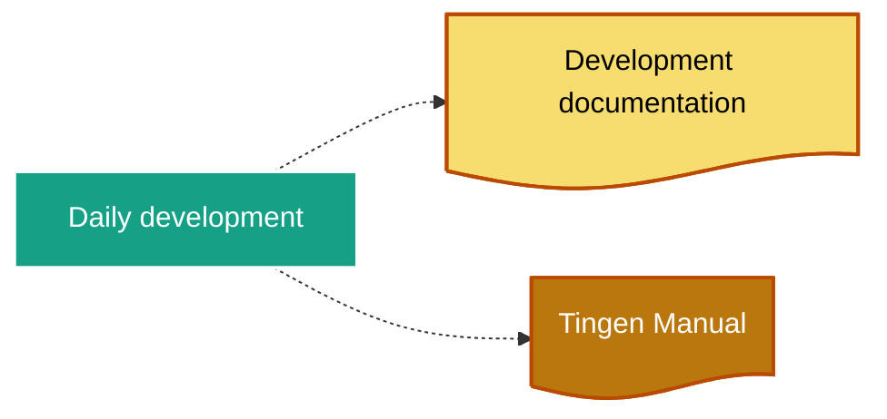
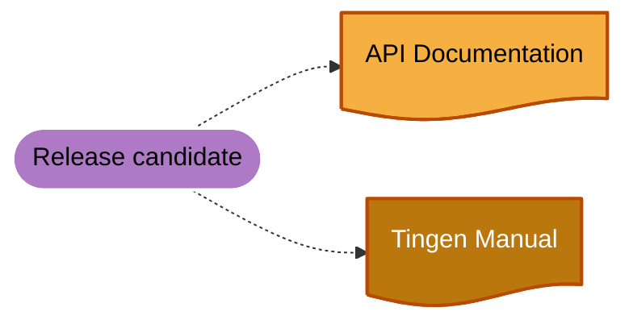
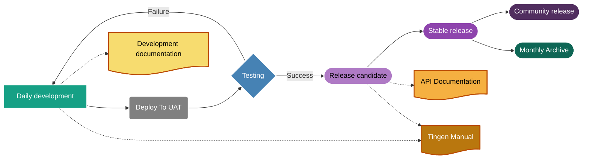

<!-- u241205 -->

<div align="center">

  

  

  <h1>
    Tingen development processes overview
  </h1>

</div>

# Overview

This is an overview of the Tingen development processes.

# Tingen development


## Development timelines

### Daily development

```mermaid

```

### Release candidates

```mermaid
flowchart LR
  %% Components
  DailyDevelopment@{shape: rect, label: "Daily development"}
  TestingSuccessful@{shape: rounded, label: "Testing (successful)"}
  ReleaseCandidate@{shape: stadium, label: "Release candidate"}
  %% Layout
  DailyDevelopment --> TestingSuccessful --> ReleaseCandidate
  %% Styles 
  style DailyDevelopment color:#FFF,fill:#16a085,stroke:#FFF,stroke-width:2px
  style TestingSuccessful color:#FFF,fill:steelblue,stroke:#FFF,stroke-width:2px
  style ReleaseCandidate color:#000,fill:#af7ac5,stroke:#FFF,stroke-width:2px
```

### Stable releases


### Community releases


### Monthly archives


# Documentation process

## Development documentation



## Release candidate documentation



## Development process

Development of Tingen.


