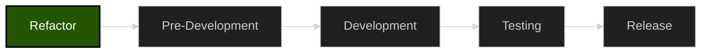
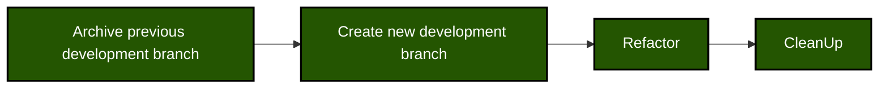
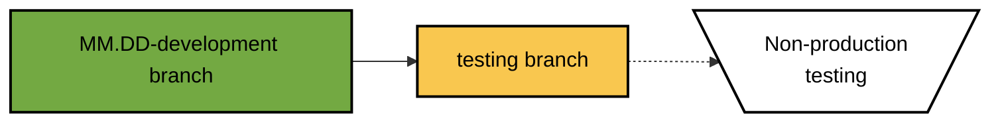

<!-- u240227 -->

<div align="center">


</div>

<br>

# Abatab development

A blurb about Abatab development.

# Development phases

Abatab development takes place across five phases:



## Refactor 



### Archive previous development branch

### Create new development branch

## Pre-development 
Features/fixes that will be included in the development version are decided upon.

## Development
Development of features/fixes.

## Testing  
Regression testing.

## Release  
Development version release.

## Timeline

```mermaid
%%{init: {'theme':'dark'}}%%
gantt
  title Development timeline
  dateFormat X
  axisFormat %d
  Refactor : 0, 5d
  Pre-Development : 1d
  Development : 22d
  Testing : 2d
  Release : 1d
```




# **Stage I**: Monthly development branch

This stage is where the majority of Abatab development takes place.

During monthly development and testing:

* Old monthly development branches are archived, and new monthly development branches are created
* The existing codebase is refactored and cleaned up
* New functionality is added, and existing functionality is updated/modified
* Bugs are squished
* Code is refactored
* New documentation is added, and existing documentation is updated/modified
* Iterative testing is done in a non-production environment

<br>


## Pre-development

Pre-development includes creating a new monthly development branch, and spending a few days refactoring and cleaning up the code and comments. This should be done prior to staring the development of new features, so the entire code base can be tested.


### Archive the previous monthly development branch

If the previous monthly development branch was not released, the branch name should remain `MM.DD-development`

If the previous monthly development branch was released, the branch name should be reanemd to `MM.DD-release`

### Create a new monthly development branch

Create a new repository branch named `MM.DD-development` from the previous monthly development branch.

### Refactor

Refactor any code that has been tagged as `// REFACTOR`

### Clean-up

Clean-up code and comments.

## Development

Development includes:

* Adding/enhancing features
* Adding/modifying documentation
* Bug fixes
* Etc.

During development, iterative testing should be done using a non-production environment.



<br>


## Timeline breakdown


On the first day of a new month, a new monthly development branch is created from the previous monthly development branch.


Abatab development takes place in the following repositories:

* `MM.DD-development`  
These are the monthly development


<br>


The current development version branch of Abatab is `v23.6`.

## Things to keep in mind about development version branches

Abatab development version branches:

* May be broken!
* May have missing functionality!
* Will have lots of ugly, gross code!
* Will have extensive comments!
* Might be dangerous to use!

<br>


<br>

## Development Version Branch

The majority of development is done in the **development version branch**, including additions and updates to documentation.

The development version branch name is the version being developed (e.g., `23.5d`). Please note the `d` postfix, which indicates that this branch is for development.

The version branch is not deployed to the web service host.


## Development branch

Once the version branch is stable, it is merged with the **Development Branch**.

This is the branch that is deployed to the web service host, and used for testing.

## Main branch

When testing functionality in the development branch is complete, it is merged with the **Main Branch**.

This is the official current development release of Abatab.

### Release types

When a version of Abatab is completed and released, the branch is renamed to `YY.MMx`, where `x` is:

* `d` for development branches that may not be fully functional
* `f` for final branches that have been tested and are fully functional
* stable
* rc
* cr
* hf


<br>

# Contributing

If you are interested in Abatab development, you will need:

* A location to host the Abatab which meets the following requirements:
* .NET Framework 4.8+ installed
* Access to yourmyAvatar™ environments via HTTPS
* [ScriptLink Standard](https://github.com/rcskids/ScriptLinkStandard)

<br>

<div align="center">

***

Abatab is developed by:<br>
[A Pretty Cool Program](https://github.com/APrettyCoolProgram)

</div>


<!--


--```mermaid
flowchart LR
  ArchivePreviousMonthlyDevelopmentBranch("Archive previous monthly\n development branch") --> CreateNewMonthlyDevelopmentBranch(Create new monthly\ndevelopment branch)
  CreateNewMonthlyDevelopmentBranch --> Refactor(Refactor) --> CleanUp(Clean-up)
  
  %%classDef Green1A4301BlackBlack fill:#1A4301, color:#000000, stroke:#000000,stroke-width:2px
  classDef Green245501WhiteBlack fill:#245501, color:#FFFFFF, stroke:#000000,stroke-width:2px
  classDef Green73A942WhiteBlack fill:#73A942, color:#FFFFFF, stroke:#000000,stroke-width:2px
  classDef GreenAAD576BlackBlack fill:#AAD576, color:#000000, stroke:#000000,stroke-width:2px
  classDef WhiteBlackBlack fill:#FFFFFF, color:#000000, stroke:#000000,stroke-width:2px
  
  class ArchivePreviousMonthlyDevelopmentBranch Green245501WhiteBlack
  class CreateNewMonthlyDevelopmentBranch Green73A942WhiteBlack
  class Refactor,CleanUp GreenAAD576BlackBlack
  class FirstDayOfTheMonth WhiteBlackBlack

```

<!-- This footer should be at the bottom of Abatab Documentation Project pages. -->

<br>

***

<div align="center">

<b>This document is part of the
[Abatab Documentation Project](https://github.com/spectrum-health-systems/Abatab-Documentation-Project)</b><br>
Last updated: February 27, 2024<br>

</div>
