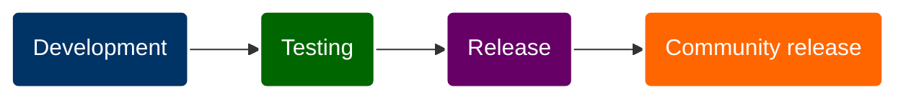
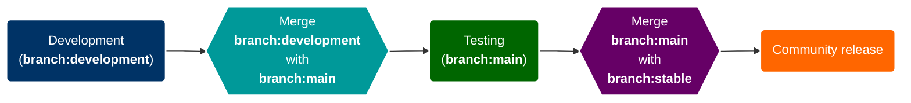
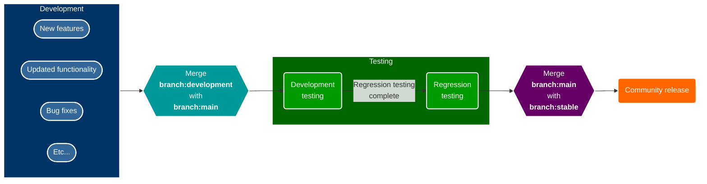

<!--
  This header should be at the top of every Abatab Documentation Project page.
  b240102
-->

# Abatab development

This document details various components of Abatab development.

# Development workflow

In general, Abatab development looks like this:

 

In more detail:

 

*Even more* more detail:

<!--
  This footer should be at the bottom of every Abatab Documentation Project page.
-->

 

***

This document is part of the
[Abatab Documentation Project](/README.md) 
	

Last updated: January 2, 2024 

