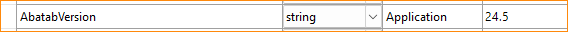

<div align="center">


  <h1>
	Adding new Abatab settings
  </h1>

</div>

<!-- The HTML indentations have to stay this way to work. -->
<table>
<tr>
<td>

  ### CONTENTS
  [Local settings](#local-settings)  
  [Runtime settings](#runtime-settings)  

</td>
</tr>
</table>

# Local settings

A local setting doesn't change between sessions, is defined in the Web.config file, and loaded at runtime.

Examples of local settings are:

- The version of Abatab
- The logging mode
- The Avatar system code

## Adding a local setting

Imagine, if you will, adding a new Abatab setting that defines the version of Abatab.

### 1. Add the setting to Abatab.Core.Catalog.Definition.AbSession.cs

Add the following to Abatab.Core.Catalog.Definition.AbSession.cs:

```csharp
/// <summary>The current Abatab version.</summary>
public string AbatabVersion { get; set; }
```
### 2. Add the setting/value to Settings.settings

Add a setting for "AbatabVersion" in the Settings.settings file:



### 3. Add the setting to Abatab.WebConfig.Load()

Add the following to the Abatab.WebConfig.Load() method:

```csharp
AbSession.AbatabVersion = Settings.Default.AbatabVersion;
```

# Runtime settings

Runtime setting are built at runtime, and are a little more complicated that local settings.

Examples of runtime settings are:

- The session date/time
- The Abatab UserName
- The Abatab Request

## Adding a runtime setting

Let's add a runtime setting for the the date/time of a session

### 1. Add the setting to Abatab.Core.Catalog.Definition.AbSession.cs

Add the following to Abatab.Core.Catalog.Definition.AbSession.cs:

```csharp
/// <summary>The session date.</summary>
/// <value>Set at runtime.</value>
public string Datestamp { get; set; }
```

### 2. Add the logic to build the setting value at runtime to Abatab.Core.Session.Build.cs

Unlike local settings that don't change between session, runtime settings often need to be "built".

For example, to "build" `AbSession.Datestamp`, you would add the following to Abatab.Core.Session.Build.cs

```csharp
abSession.Datestamp = $"{DateTime.Now:yyMMdd}";
```

<br>
<br>

***

<div align="center">

This document is part of the
<b>[Abatab Documentation Project](https://github.com/spectrum-health-systems/Abatab-Documentation-Project)</b><br>

</div>