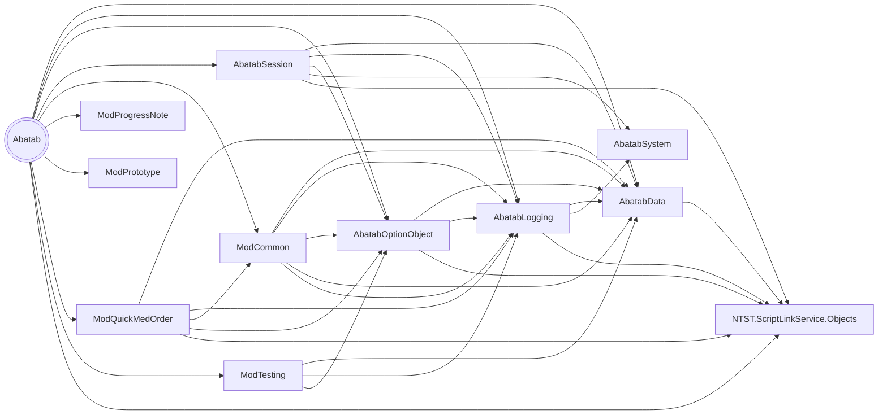
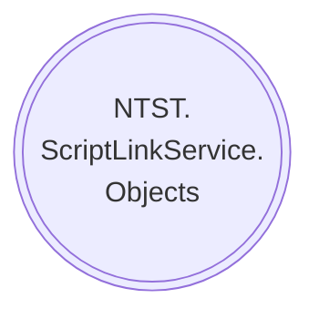

![Logo][Logo]

# PROJECT REFERENCES

<h3>
  <b>Abatab v23.1</b>
</h3>

<h5>
  Last updated Feburary 6, 2023
</h5>

# Abatab

***

# NTST.ScriptLinkService.Objects

***

# DocFX

[Logo]: ../../resources/images/logos/AbatabLogo.png