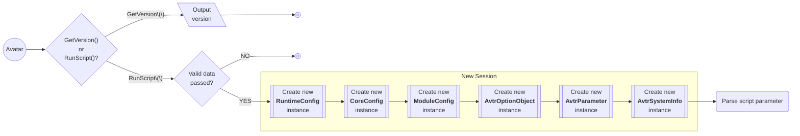
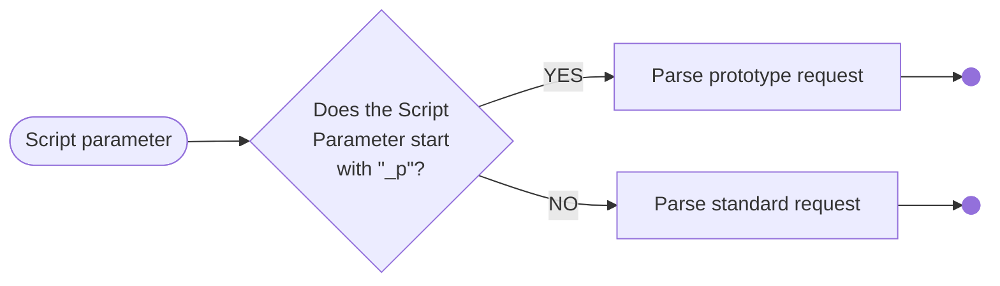
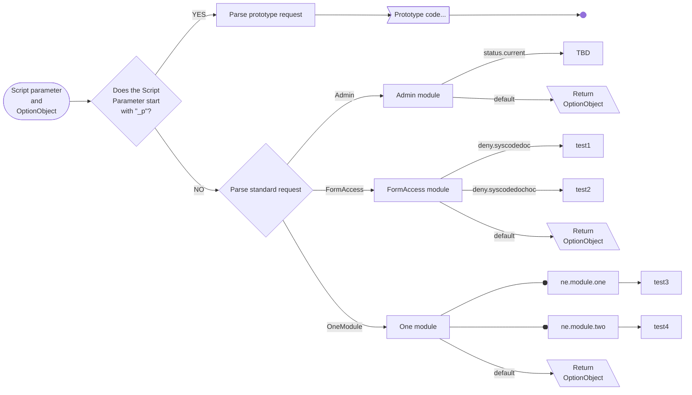

<!-- u250716 -->

# Initializing the Tingen Web Service

```mermaid
flowchart LR

  Start_TingenWebService@{ shape: circle, label: "Avatar" } -->
    GetVersionOrRunScript@{ shape: diam, label: "GetVersion()\nor\nRunScript()?" }
  
  GetVersionOrRunScript --GetVersion\(\)-->
    OutputVersion@{ shape: lean-l, label: "Output\nversion" } -->
    Stop_GetVersion@{ shape: fr-circ }

  GetVersionOrRunScript --RunScript\(\)-->
    ValidDataPassed@{ shape: diam, label: "Valid data\npassed?" }
    ValidDataPassed --NO-->
      Stop_ValidDataNotPassed@{ shape: fr-circ }
    ValidDataPassed --YES--> RuntimeConfig.New

    subgraph Initialize ["New Session"]
      direction TB

      RuntimeConfig.New@{ shape: fr-rect, label: "Create new\n**RuntimeConfig**\ninstance" } -->
      CoreConfig.New@{ shape: fr-rect, label: "Create new\n**CoreConfig**\ninstance" } -->
      ModuleConfig.New@{ shape: fr-rect, label: "Create new\n**ModuleConfig**\ninstance" } -->
      AvtrOptionObject.New@{ shape: fr-rect, label: "Create new\n**AvtrOptionObject**\ninstance" } -->
      AvtrParameter.New@{ shape: fr-rect, label: "Create new\n**AvtrParameter**\ninstance" } -->
      AvtrSystemInfo.New@{ shape: fr-rect, label: "Create new\n**AvtrSystemInfo**\ninstance" }
    end

    AvtrSystemInfo.New --> Parse_ScriptParameter@{ shape: rounded, label: "Parse script parameter" }
```

# Determine the type of request

```mermaid
flowchart LR

  ScriptParameter@{ shape: stadium, label: "Script parameter" } -->
    ScriptParameterStartsWithP@{ shape: diam, label: "Does the Script\nParameter start\nwith \"_p\"?" }
      ScriptParameterStartsWithP --YES-->
        ParsePrototypeRequest@{ shape: rect, label: "Parse prototype request" } -->
          PrototypeCode@{ shape: junction}
      ScriptParameterStartsWithP --NO-->
          StandardRequest@{ shape: rect, label: "Parse standard request" } -->
            StandardCode@{ shape: junction}
```

# Standard requests

## The Admin Module

```mermaid
flowchart LR

  ScriptParameter@{ shape: stadium, label: "Script parameter\nand\nOptionObject" } -->
    ScriptParameterStartsWithP@{ shape: diam, label: "Does the Script\nParameter start\nwith \"_p\"?" }
      ScriptParameterStartsWithP --YES-->
        ParsePrototypeRequest@{ shape: rect, label: "Parse prototype request" } -->
          PrototypeRequest@{ shape: odd, label: "Prototype code..." } -->
            PrototypeCode@{ shape: junction}
      ScriptParameterStartsWithP --NO-->
          StandardRequest@{ shape: diam, label: "Parse standard request" } --Admin-->
            AdminModule@{ shape: rect, label: "Admin module" } --status.current-->
              AdminStatusCurrent@{ shape: rect, label: "TBD" }
            AdminModule --default-->
              AdminModule_ReturnObject@{ shape: lean-l, label: "Return\nOptionObject" }
          StandardRequest --FormAccess-->
            FormAccessModule@{ shape: rect, label: "FormAccess module" } --deny.syscodedoc--> test1
            FormAccessModule --deny.syscodedochoc--> test2
            FormAccessModule --default-->
              FormAccessModule_ReturnObject@{ shape: lean-l, label: "Return\nOptionObject" }
          StandardRequest --OneModule-->
            OneModule@{ shape: rect, label: "One module" } --one.module.one--> test3
            OneModule --one.module.two--> test4
            OneModule --default-->
              OneModule_ReturnObject@{ shape: lean-l, label: "Return\nOptionObject" }
```