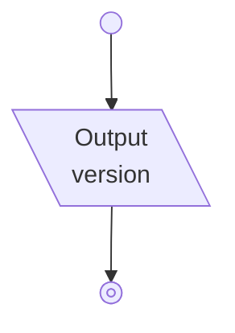

<!-- u250716 -->

# TingenWebService.asmx.GetVersion()

```mermaid
flowchart TB
  %% Components      
  Start@{ shape: sm-circ }
  OutputVersion@{ shape: lean-l, label: "Output\nversion" }
  Stop@{ shape: fr-circ }
  %%Layout
  Start --> OutputVersion --> Stop
```
