<!-- u250716 -->

<!--

```mermaid
flowchart TB

    subgraph TingenWebService.asmx.cs ["TingenWebService.asmx.cs"]
        direction TB
        %% Components
        Start@{ shape: sm-circ }
        GetVersionOrRunScript@{ shape: diam, label: "GetVersion()\nor\nRunScript()?" }
        subgraph TingenWebService.asmx.GetVersion ["TingenWebService.asmx.GetVersion()"]
            direction TB
            %% Components
            Start_GetVersion@{ shape: junction }
            OutputVersion@{ shape: lean-l, label: "Output\nversion" }
            Stop_GetVersion@{ shape: fr-circ }
            %% Layout
            Start_GetVersion --> OutputVersion --> Stop_GetVersion
        end
        subgraph TingenWebService.asmx.RunScript ["TingenWebService.asmx.RunScript()"]
            direction TB
            %% Components
            Start_RunScript@{ shape: junction }
            ValidDataPassed@{ shape: diam, label: "Valid data\npassed?" }
            CreateNewSessionInstance@{ shape: rect, label: "Create new\nsession instance" }
            Stop_ValidDataNotPassed@{ shape: fr-circ }
            ParseScriptParameter@{ shape: rect, label: "Parse script\nparameter" }
            ReturnOptionObjectToAvatar@{ shape: lean-r, label: "Return OptionObject\nto Avatar" }
            Stop_ReturnedOptionObject@{ shape: fr-circ }
            %% Layout
            Start_RunScript --> ValidDataPassed
            ValidDataPassed --NO--> Stop_ValidDataNotPassed
            ValidDataPassed --YES--> CreateNewSessionInstance
        end
        %% Components
        Start --> GetVersionOrRunScript
        %% Layout
        GetVersionOrRunScript --GetVersion--> Start_GetVersion
        GetVersionOrRunScript --RunScript--> Start_RunScript
    end
    subgraph Outpost31.Core.Session.WsvcSession.cs ["Outpost31.Core.Session.WsvcSession.cs"]
        direction TB
        subgraph Outpost31.Core.Session.WsvcSession.New ["Outpost31.Core.Session.WsvcSession.New"]
            direction TB
            %% Components
            Start_WsvcSession.New@{ shape: junction }
            CreateNewRuntimeConfigInstance@{ shape: rect, label: "Create new\n**RuntimeConfig**\ninstance" }
            CreateNewCoreConfigInstance@{ shape: rect, label: "Create new\n**CoreConfig**\ninstance" }
            CreateNewModuleConfigInstance@{ shape: rect, label: "Create new\n**ModuleConfig**\ninstance" }
            CreateNewAvtrOptionObjectInstance@{ shape: rect, label: "Create new\n**AvtrOptionObject**\ninstance" }
            CreateNewAvtrParameterInstance@{ shape: rect, label: "Create new\n**AvtrParameter**\ninstance" }
            CreateNewAvtrSystemInfoInstance@{ shape: rect, label: "Create new\n**AvtrSystemInfo**\ninstance" }
            %% Layout
            Start_WsvcSession.New --> CreateNewRuntimeConfigInstance --> CreateNewCoreConfigInstance
            CreateNewCoreConfigInstance --> CreateNewModuleConfigInstance  --> CreateNewAvtrOptionObjectInstance
            CreateNewAvtrOptionObjectInstance --> CreateNewAvtrParameterInstance --> CreateNewAvtrSystemInfoInstance
        end    
        subgraph three ["three"]
            direction TB
        end
    end

   %% Layout
   CreateNewSessionInstance --> Start_WsvcSession.New
   CreateNewAvtrSystemInfoInstance --> ParseScriptParameter
  
  %% Styles
  classDef R0_ stroke:#f9ebea,stroke-width:3px,fill:#f9ebea,color:#641e16
  classDef R1_ stroke:#f9ebea,stroke-width:3px,fill:#E6B0AA,color:#641e16
  classDef R2_ stroke:#f9ebea,stroke-width:3px,fill:#CD6155,color:#f9ebea
  classDef R3_ stroke:#f9ebea,stroke-width:3px,fill:#A93226,color:#f9ebea
  classDef R4_ stroke:#f9ebea,stroke-width:3px,fill:#641e16,color:#f9ebea
  classDef R5_ stroke:#641e16,stroke-width:3px,fill:#f9ebea,color:#641e16
  classDef R6_ stroke:#641e16,stroke-width:3px,fill:#E6B0AA,color:#641e16
  classDef R7_ stroke:#641e16,stroke-width:3px,fill:#CD6155,color:#f9ebea
  classDef R8_ stroke:#641e16,stroke-width:3px,fill:#A93226,color:#f9ebea
  classDef R9_ stroke:#641e16,stroke-width:3px,fill:#641e16,color:#f9ebea
  classDef P0_ stroke:#f5eef8,stroke-width:3px,fill:#f5eef8,color:#512e5f
  classDef P1_ stroke:#f5eef8,stroke-width:3px,fill:#d7bde2,color:#512e5f
  classDef P2_ stroke:#f5eef8,stroke-width:3px,fill:#af7ac5,color:#f5eef8
  classDef P3_ stroke:#f5eef8,stroke-width:3px,fill:#884ea0,color:#f5eef8
  classDef P4_ stroke:#f5eef8,stroke-width:3px,fill:#512e5f,color:#f5eef8
  classDef P5_ stroke:#512e5f,stroke-width:3px,fill:#f5eef8,color:#512e5f
  classDef P6_ stroke:#512e5f,stroke-width:3px,fill:#d7bde2,color:#512e5f
  classDef P7_ stroke:#512e5f,stroke-width:3px,fill:#af7ac5,color:#f5eef8
  classDef P8_ stroke:#512e5f,stroke-width:3px,fill:#884ea0,color:#f5eef8
  classDef P9_ stroke:#512e5f,stroke-width:3px,fill:#512e5f,color:#f5eef8
  classDef U0_ stroke:#eaf2f8,stroke-width:3px,fill:#eaf2f8,color:#154360
  classDef U1_ stroke:#eaf2f8,stroke-width:3px,fill:#a9cce3,color:#154360
  classDef U2_ stroke:#eaf2f8,stroke-width:3px,fill:#5499c7,color:#eaf2f8
  classDef U3_ stroke:#eaf2f8,stroke-width:3px,fill:#2471a3,color:#eaf2f8
  classDef U4_ stroke:#eaf2f8,stroke-width:3px,fill:#154360,color:#eaf2f8
  classDef U5_ stroke:#154360,stroke-width:3px,fill:#eaf2f8,color:#154360
  classDef U6_ stroke:#154360,stroke-width:3px,fill:#a9cce3,color:#154360
  classDef U7_ stroke:#154360,stroke-width:3px,fill:#5499c7,color:#eaf2f8
  classDef U8_ stroke:#154360,stroke-width:3px,fill:#2471a3,color:#eaf2f8
  classDef U9_ stroke:#154360,stroke-width:3px,fill:#154360,color:#eaf2f8
  classDef G0_ stroke:#e9f7ef,stroke-width:3px,fill:#eaf2f8,color:#154360
  classDef G1_ stroke:#e9f7ef,stroke-width:3px,fill:#a9dfbf,color:#145a32
  classDef G2_ stroke:#e9f7ef,stroke-width:3px,fill:#52be80,color:#e9f7ef
  classDef G3_ stroke:#e9f7ef,stroke-width:3px,fill:#1d8348,color:#e9f7ef
  classDef G4_ stroke:#e9f7ef,stroke-width:3px,fill:#145a32,color:#e9f7ef
  classDef G5_ stroke:#145a32,stroke-width:3px,fill:#eaf2f8,color:#154360
  classDef G6_ stroke:#145a32,stroke-width:3px,fill:#a9dfbf,color:#145a32
  classDef G7_ stroke:#145a32,stroke-width:3px,fill:#52be80,color:#e9f7ef
  classDef G8_ stroke:#145a32,stroke-width:3px,fill:#1d8348,color:#e9f7ef
  classDef G9_ stroke:#145a32,stroke-width:3px,fill:#145a32,color:#e9f7ef
  classDef Y0_ stroke:#fef9e7,stroke-width:3px,fill:#fef9e7,color:#7d6608
  classDef Y1_ stroke:#fef9e7,stroke-width:3px,fill:#f9e79f,color:#7d6608
  classDef Y2_ stroke:#fef9e7,stroke-width:3px,fill:#f4d03f,color:#7d6608
  classDef Y3_ stroke:#fef9e7,stroke-width:3px,fill:#d4ac0d,color:#fef9e7
  classDef Y4_ stroke:#fef9e7,stroke-width:3px,fill:#7d6608,color:#fef9e7
  classDef Y5_ stroke:#7d6608,stroke-width:3px,fill:#fef9e7,color:#7d6608
  classDef Y6_ stroke:#7d6608,stroke-width:3px,fill:#f9e79f,color:#7d6608
  classDef Y7_ stroke:#7d6608,stroke-width:3px,fill:#f4d03f,color:#7d6608
  classDef Y8_ stroke:#7d6608,stroke-width:3px,fill:#d4ac0d,color:#fef9e7
  classDef Y9_ stroke:#7d6608,stroke-width:3px,fill:#7d6608,color:#fef9e7
  classDef E0_ stroke:#fdf2e9,stroke-width:3px,fill:#fdf2e9,color:#784212
  classDef E1_ stroke:#fdf2e9,stroke-width:3px,fill:#f8c471,color:#784212  
  classDef E2_ stroke:#fdf2e9,stroke-width:3px,fill:#f5b041,color:#fdf2e9
  classDef E3_ stroke:#fdf2e9,stroke-width:3px,fill:#ca6f1e,color:#fdf2e9
  classDef E4_ stroke:#fdf2e9,stroke-width:3px,fill:#784212,color:#fdf2e9
  classDef E5_ stroke:#784212,stroke-width:3px,fill:#fdf2e9,color:#784212
  classDef E6_ stroke:#784212,stroke-width:3px,fill:#f8c471,color:#784212  
  classDef E7_ stroke:#784212,stroke-width:3px,fill:#f5b041,color:#fdf2e9
  classDef E8_ stroke:#784212,stroke-width:3px,fill:#ca6f1e,color:#fdf2e9
  classDef E9_ stroke:#784212,stroke-width:3px,fill:#784212,color:#fdf2e9
  classDef W0_ stroke:#FFFFFF,stroke-width:3px,fill:#FFFFFF,color:#000000
  classDef W1_ stroke:#641e16,stroke-width:3px,fill:#FFFFFF,color:#641e16
  classDef W2_ stroke:#af7ac5,stroke-width:3px,fill:#FFFFFF,color:#af7ac5
  classDef W3_ stroke:#5499c7,stroke-width:3px,fill:#FFFFFF,color:#5499c7
  classDef W4_ stroke:#52be80,stroke-width:3px,fill:#FFFFFF,color:#52be80
  classDef W5_ stroke:#d4ac0d,stroke-width:3px,fill:#FFFFFF,color:#d4ac0d
  classDef W6_ stroke:#ca6f1e,stroke-width:3px,fill:#FFFFFF,color:#ca6f1e 
  classDef W7_ stroke:#7b7d7d,stroke-width:3px,fill:#FFFFFF,color:#7b7d7d
  classDef W8_ stroke:#424949,stroke-width:3px,fill:#FFFFFF,color:#424949
  classDef W9_ stroke:#000000,stroke-width:3px,fill:#FFFFFF,color:#000000
  classDef B0_ stroke:#FFFFFF,stroke-width:3px,fill:#000000,color:#FFFFFF
  classDef B1_ stroke:#CD6155,stroke-width:3px,fill:#000000,color:#CD6155
  classDef B2_ stroke:#af7ac5,stroke-width:3px,fill:#000000,color:#af7ac5
  classDef B3_ stroke:#5499c7,stroke-width:3px,fill:#000000,color:#5499c7
  classDef B4_ stroke:#52be80,stroke-width:3px,fill:#000000,color:#52be80
  classDef B5_ stroke:#d4ac0d,stroke-width:3px,fill:#000000,color:#d4ac0d
  classDef B6_ stroke:#ca6f1e,stroke-width:3px,fill:#000000,color:#ca6f1e 
  classDef B7_ stroke:#7b7d7d,stroke-width:3px,fill:#000000,color:#7b7d7d
  classDef B8_ stroke:#626567,stroke-width:3px,fill:#000000,color:#626567 
  classDef B9_ stroke:#000000,stroke-width:3px,fill:#000000,color:#FFFFFF
```

    subgraph one ["one"]
        direction TB
        %% Components
        
        %% Layout

        subgraph two ["two"]
            direction TB
            %% Components
            %% Layout
        end
        
        subgraph three ["three"]
            direction TB
            %% Components
            %% Layout
        end
    end

-->