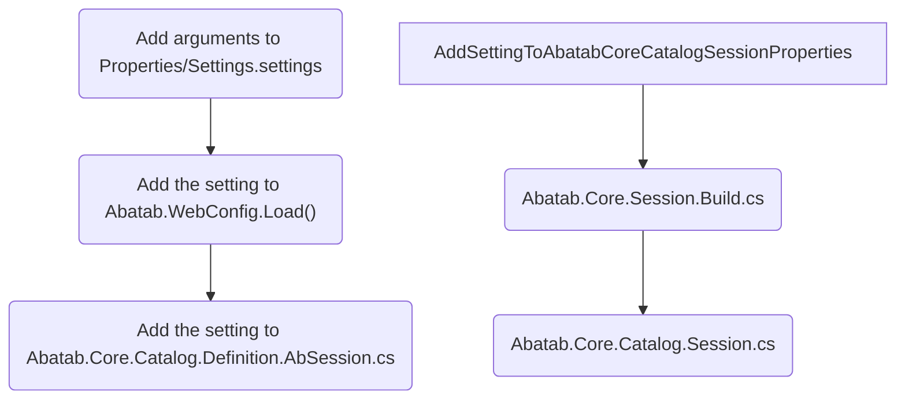
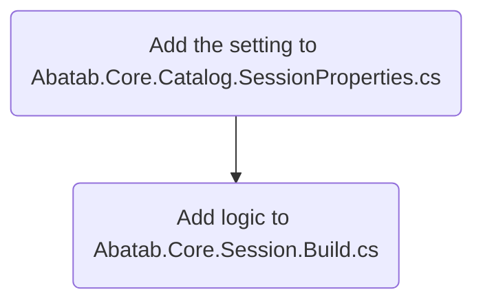

<!--
  This documentation is incomplete.
-->

<div align="center">

  

  <h1>
    Adding New Settings
  </h1>

</div>

<br>

<!--
  The HTML indentations have to stay this way to work.
-->
<table>
<tr>
<td img src="imaginare-spacer.png" alt="blank-spacer" width="1000" height="1">

  ### CONTENTS
  [Adding a new local setting](#adding-a-new-local-setting)<br>
  [Adding a new runtime setting](#adding-a-new-runtime-setting)

</td>
</tr>
</table>

# Adding a new local setting

<!--
  ******************************************************************************
  This section needs to be reviewed/updated
  ******************************************************************************
-->

<div align="center">



</div>

## Add the setting to Settings.settings

Simply add the new setting/value to the file.

## Add the setting to WebConfig.Load()

For example, to add the `AbatabDataRoot` setting, you would take the webConfig Dictionary in Abatab.WebConfig.Load():

```csharp
{ "AbatabMode",                             Settings.Default.AbatabMode.ToLower() },
{ "AbatabRoot",                             Settings.Default.AbatabRoot.ToLower() },
```

And add a line for `AbatabDataRoot`:

```csharp
{ "AbatabMode",                             Settings.Default.AbatabMode.ToLower() },
{ "AbatabRoot",                             Settings.Default.AbatabRoot.ToLower() },
{ "AbatabDataRoot",                         Settings.Default.AbatabDataRoot.ToLower() },
```

## Add the setting to Abatab.Core.Catalog.SessionProperties.cs

Just add the setting where it belongs.

## Add setting to Abatab.Core.Session.Build.cs

For example, to add the `AbatabDataRoot` setting, you would take the webConfig Dictionary in Abatab.WebConfig.Load():

```csharp
var abatabSession = new Session
{
    AbatabMode             = webConfig["AbatabMode"],
    AbatabRoot             = $@"{webConfig["AbatabRoot"]}{webConfig["AvatarEnvironment"]}"
};
```

And add a line for `AbatabDataRoot`:

```csharp
var abatabSession = new Session
{
    AbatabMode             = webConfig["AbatabMode"],
    AbatabRoot             = $@"{webConfig["AbatabRoot"]}{webConfig["AvatarEnvironment"]}",
    AbatabDataRoot         = $@"{webConfig["AbatabDataRoot"]}\{webConfig["AvatarEnvironment"]}"
};
```

## Add setting to Abatab.Core.Catalog.Session.cs

Add the new setting here so it's exported with logfiles.

<br>
<br>

# Adding a new runtime setting <!-- Last updated: 230329.1121 -->

<div align="center">



</div>

## Add the setting to Abatab.Core.Catalog.SessionProperties.cs

For example, to add the `ModProgressNote.ValidLocationNames` setting, you would add the following to `Abatab.Core.Catalog.Definition.ModProgressNote`:

```csharp
public List<string> ValidLocationNames { get; set; }
```

So `Abatab.Core.Catalog.Definition.ModProgressNote` would look like this:

```csharp
public class ModProgressNote
{
    /// <summary>Summary goes here.</summary>
    public string Mode { get; set; }

    /// <summary>Summary goes here.</summary>
    public string AuthorizedUsers { get; set; }

    /// <summary>Summary goes here.</summary>
    public string ServiceChargeCodeFieldId { get; set; }

    /// <summary>Summary goes here.</summary>
    public List<string> ServiceChargeCodePrefixes { get; set; }

    /// <summary>Summary goes here.</summary>
    public List<string> ServiceChargeCodesCheck { get; set; }

    /// <summary>Summary goes here.</summary>
    public string LocationFieldId { get; set; }

    /// <summary>Summary goes here.</summary>
    public List<string> ValidLocationCodes { get; set; }

    /// <summary>Summary goes here.</summary>
    public List<string> ValidLocationNames { get; set; }
}
```

## Add logic to Abatab.Core.Session.Build.cs

Next add the logic for `ModProgressNote.ValidLocationNames` to `Abatab.Core.Session.Build.BuildModProgressNote()`

```csharp
abSession.ModProgressNote.ValidLocationCodes  = new List<string>()
{
    "Telehealth Patient Home",
    "Telehealth Patient Loc Not Home"
};
```

So `Abatab.Core.Session.Build.BuildModProgressNote()` would look like this:

```csharp
private static void BuildModProgressNote(AbSession abSession)
{
    LogEvent.Trace(abSession, AssemblyName);

    abSession.ModProgressNote.ServiceChargeCodeFieldId  = "51001";
    abSession.ModProgressNote.ServiceChargeCodePrefixes = new List<string>()
    {
        "TMH",
        "AOTMH"
    };
    abSession.ModProgressNote.ServiceChargeCodesCheck  = new List<string>()
    {
        "TMH90853",
        "AOTMH90853"
    };

    abSession.ModProgressNote.LocationFieldId = "50004";
    abSession.ModProgressNote.ValidLocationCodes  = new List<string>()
    {
        "T110",
        "T102"
    };
    abSession.ModProgressNote.ValidLocationCodes  = new List<string>()
    {
        "Telehealth Patient Home",
        "Telehealth Patient Loc Not Home"
    };
}
```

<br>

***

<div align="center">

  This document is part of the [Abatab Documentation Project](../Abatab%20Documentation%20Project.md).

  <h5>
    Last updated: May 30, 2023
  </h5>

</div>
