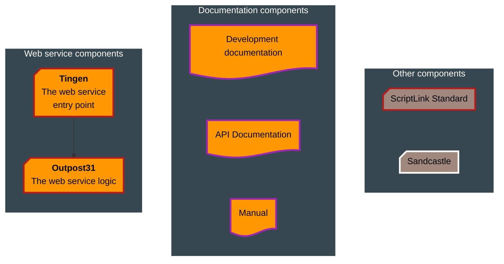

<!-- u250306 -->

> Last updated: March 6, 2025

  

  
  
 <h1>Tingen components</h1>

The Tingen web service is comprised of the following components:

```mermaid
flowchart TB
  subgraph Other["Other components"]
      direction TB
      %% Components
      ScriptLinkStandard@{shape: notch-rect, label: "ScriptLink Standard"}
      Sandcastle@{shape: notch-rect, label: "Sandcastle"}
      %% Layout
      ScriptLinkStandard ~~~ Sandcastle
  end
  subgraph Documentation["Documentation components"]
      direction TB
      %% Components
      DevelopmentDocumentation@{shape: doc, label: "Development documentation"}
      ApiDocumentation@{shape: doc, label: "API Documentation"}
      Manual@{shape: doc, label: "Manual"}
      %% Layout
      DevelopmentDocumentation ~~~ ApiDocumentation ~~~ Manual
  end
  subgraph WebService["Web service components"]
      direction TB
      %% Components
      Tingen@{shape: notch-rect, label: "**Tingen**<br/>The web service<br/>entry point"}
      Outpost31@{shape: notch-rect, label: "**Outpost31**<br/>The web service logic"}
      %% Layout
      Tingen --> Outpost31
  end
  %% Styles
  style WebService color:#FFF,fill:#37474f,stroke:#FFF,stroke-width:3px
  style Tingen color:#000,fill:#ff9800,stroke:#b71c1c,stroke-width:3px
  style Outpost31 color:#000,fill:#ff9800,stroke:#b71c1c,stroke-width:3px
  style Documentation color:#FFF,fill:#37474f,stroke:#FFF,stroke-width:3px
  style DevelopmentDocumentation color:#000,fill:#ff9800,stroke:#9c27b0,stroke-width:3px
  style ApiDocumentation color:#000,fill:#ff9800,stroke:#9c27b0,stroke-width:3px
  style Manual color:#000,fill:#ff9800,stroke:#9c27b0,stroke-width:3px
  style Other color:#FFF,fill:#37474f,stroke:#FFF,stroke-width:3px
  style ScriptLinkStandard color:#000,fill:#a1887f,stroke:#b71c1c,stroke-width:3px
  style Sandcastle color:#000,fill:#a1887f,stroke:#FFF,stroke-width:3px
  %% Links 
  click Tingen "https://github.com/spectrum-health-systems/Tingen_development"
  click Outpost31 "https://github.com/spectrum-health-systems/Outpost31"
  click DevelopmentDocumentation "https://github.com/spectrum-health-systems/Tingen-Documentation/blob/main/Development"
  click ApiDocumentation "https://github.com/spectrum-health-systems/Tingen-Documentation/blob/main/docs"
  click Manual "https://github.com/spectrum-health-systems/Tingen-Documentation/blob/main/Manual"
  click ScriptLinkStandard "https://github.com/rcskids/ScriptLinkStandard"
  click Sandcastle "https://github.com/EWSoftware/SHFB"
```

