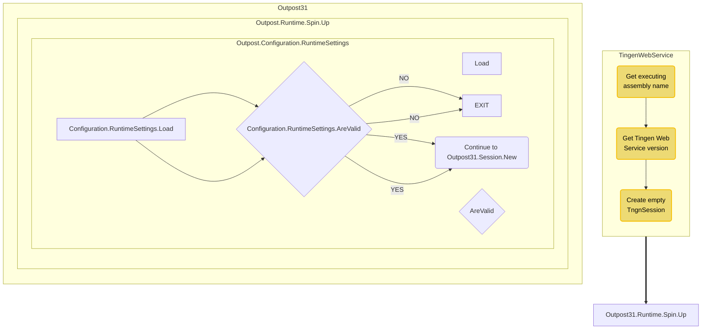

# Tingen Web Service

# FLOW



  GetExecutingAssemblyName --> GetTngnVersion["Get TngnVersion"] --> CreateEmptyTngnSession["Create Empty TngnSession"] --> Outpost31.Runtime.Spin.Up

  subgraph Outpost31.Runtime.Spin.Up
    direction TB
    Configuration.RuntimeSettings.Load --> Configuration.RuntimeSettings.AreValid
    Configuration.RuntimeSettings.AreValid{"Configuration.RuntimeSettings.AreValid"} --NO--> EXIT
    Configuration.RuntimeSettings.AreValid --YES --> Continue_Outpost31.Session.New("Continue to Outpost31.Session.New")
  end

  Outpost31.Runtime.Spin.Up --> Outpost31.Session.New

  subgraph Outpost31.Session.New
    direction TB
    DoSomething --> DoSomethingElse
  end

# DEVELOPMENT GUIDELINES

Guidelines for the following can be found [here](https://github.com/APrettyCoolProgram/APrettyCoolProgram):

* Classes/methods
* Syntax
* Formatting
* Versioning
* Comments
* XML documentation
* File headers
* Mermaid

# SNIPPETS

```
/// <summary>The executing Assembly name.</summary>
/// <remarks>A required component for writing log files, defined here so it can be used throughout the class.</remarks>
public static string ExeAsm { get; set; } = Assembly.GetExecutingAssembly().GetName().Name;
```

```
/* Logging infrastructure hasn't been initialized yet, so if you need to create a log file here, use a Primeval Log.
 */
```

# HEADERS

## Tingen

```
// The
// ████████╗██╗███╗   ██╗ ██████╗ ███████╗███╗   ██╗
// ╚══██╔══╝██║████╗  ██║██╔════╝ ██╔════╝████╗  ██║
//    ██║   ██║██╔██╗ ██║██║  ███╗█████╗  ██╔██╗ ██║
//    ██║   ██║██║╚██╗██║██║   ██║██╔══╝  ██║╚██╗██║
//    ██║   ██║██║ ╚████║╚██████╔╝███████╗██║ ╚████║
//    ╚═╝   ╚═╝╚═╝  ╚═══╝ ╚═════╝ ╚══════╝╚═╝  ╚═══╝
//                                       Web Service
//                      Development Release XX.yy.zz
//
// https://github.com/APrettyCoolProgram/Tingen-WebService
// Copyright (c) A Pretty Cool Program. All rights reserved.
// Licensed under the Apache 2.0 license.
//
// uYYMMDD_code
// uYYMMDD_documentation

```

## Outpost31

### WelcomeToOutpost31.cs

```
//  Welcome to
//  ██████╗ ██╗   ██╗████████╗██████╗  ██████╗ ███████╗████████╗    ██████╗  ██╗
// ██╔═══██╗██║   ██║╚══██╔══╝██╔══██╗██╔═══██╗██╔════╝╚══██╔══╝    ╚════██╗███║
// ██║   ██║██║   ██║   ██║   ██████╔╝██║   ██║███████╗   ██║        █████╔╝╚██║
// ██║   ██║██║   ██║   ██║   ██╔═══╝ ██║   ██║╚════██║   ██║        ╚═══██╗ ██║
// ╚██████╔╝╚██████╔╝   ██║   ██║     ╚██████╔╝███████║   ██║       ██████╔╝ ██║
//  ╚═════╝  ╚═════╝    ╚═╝   ╚═╝      ╚═════╝ ╚══════╝   ╚═╝       ╚═════╝  ╚═╝
//                                 The back-end logic for the Tingen Web Service
//                                                  Development Release XX.yy.zz
// https://github.com/APrettyCoolProgram/Outpost31
// Copyright(c) A Pretty Cool Program. All rights reserved.
// Licensed under the Apache 2.0 license.
//
// uYYMMDD_code
// uYYMMDD_documentation
```

### Other Outpost31 classes

```
//  ██████  ██  ██ ██████ █████ ██████ █████  ██████   ██████  ███ 
//  ██  ██  ██  ██   ██   █████ ██  ██ ██████   ██        ███   ██ 
//  ██████  ██████   ██   ██    ██████  █████   ██     ██████   ██ 
//                             Outpost31.Core.Avatar.SystemCode.cs
//                                   Logic for Avatar System Codes
// uYYMMDD_code
// uYYMMDD_documentation
```


