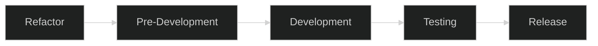

<!-- u240227 -->

 

# Abatab development timeline

Abatab development takes place across five phases:

1. **Refactor**  
Prior to developing a new version of Abatab, the previous version should be cleaned up and refactored.

2. **Pre-development**  
Features/fixes that will be included in the development version are decided upon.

3. **Development**  
Development of features/fixes.

4. **Testing**  
Regression testing.

5. **Release**  
Development version release.

```mermaid
%%{init: {'theme':'dark'}}%%
gantt
  title Abatab development
  dateFormat X
  axisFormat %d
  Refactor : 0, 5d
  Pre-Development : 1d
  Development : 22d
  Testing : 2d
  Release : 1d
```

<!-- This footer should be at the bottom of Abatab Documentation Project pages. -->

[< Back to development documentation](README.md)

 

***

<b>This document is part of the
[Abatab Documentation Project](https://github.com/spectrum-health-systems/Abatab-Documentation-Project)</b> 
Last updated: February 27, 2024 

