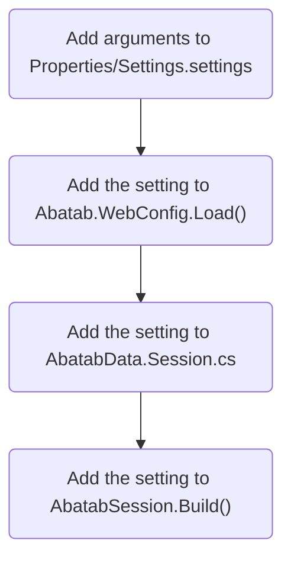

<div align="center">

![Logo][Logo]

# ADDING A NEW LOCAL SETTING

<h5>
  Last updated Feburary 21, 2023
</h5>

</div>

# Overview

Abatab local settings are stored in the local Web.config file, which is created when the project is built.

This document will detail how to add a new local setting to Abatab.


<div align="center">



</div>

## Add setting to WebConfig

For example, to add the `AbatabDataRoot` setting, you would take the webConfig Dictionary in Abatab.WebConfig.Load():

```
{ "AbatabMode",                             Settings.Default.AbatabMode.ToLower() },
{ "AbatabRoot",                             Settings.Default.AbatabRoot.ToLower() },
```

And add a line for `AbatabDataRoot`:

```
{ "AbatabMode",                             Settings.Default.AbatabMode.ToLower() },
{ "AbatabRoot",                             Settings.Default.AbatabRoot.ToLower() },
{ "AbatabDataRoot",                         Settings.Default.AbatabDataRoot.ToLower() },
```

## Add setting to AbatabSession.Build()

For example, to add the `AbatabDataRoot` setting, you would take the webConfig Dictionary in Abatab.WebConfig.Load():

```
var abatabSession = new Session
{
    AbatabMode             = webConfig["AbatabMode"],
    AbatabRoot             = $@"{webConfig["AbatabRoot"]}{webConfig["AvatarEnvironment"]}"
};
```

And add a line for `AbatabDataRoot`:

```
var abatabSession = new Session
{
    AbatabMode             = webConfig["AbatabMode"],
    AbatabRoot             = $@"{webConfig["AbatabRoot"]}{webConfig["AvatarEnvironment"]}",
    AbatabDataRoot         = $@"{webConfig["AbatabDataRoot"]}\{webConfig["AvatarEnvironment"]}"
};
```
