```mermaid
---
title: Abatab.Flightpath.cs
---
graph TD

  Abatab.Flightpath.StartAbatab("Abatab.Flightpath.StartAbatab()") --> Abatab.WebConfig.Load("Abatab.WebConfig.Load()")
  Abatab.WebConfig.Load                                            --> Core.Session.BuildNewSession("Core.Session.BuildNewSession()")
  Core.Session.BuildNewSession                                     --> DailySessionDirectoryExists{Daily session\ndirectory exists}
  
  DailySessionDirectoryExists  -- YES --> Abatab.Roundhouse.ParseModule("Abatab.Roundhouse.ParseModule()")
  
  DailySessionDirectoryExists  -- NO --> Core.Framework.Refresh.Daily("Core.Framework.Refresh.Daily()")
  Core.Framework.Refresh.Daily --> Abatab.Roundhouse.ParseModule("Abatab.Roundhouse.ParseModule()")

  classDef Abatab fill:#000000, stroke:#F94144,stroke-width:2px
  classDef CoreCatalog fill:#000000, stroke:#277DA1,stroke-width:2px
  classDef CoreDataExport fill:#000000, stroke:#F3722C,stroke-width:2px
  classDef CoreFramework fill:#000000, stroke:#577590,stroke-width:2px
  classDef CoreLogger fill:#000000, stroke:#F8961E,stroke-width:2px
  classDef CoreSession fill:#000000, stroke:#4D908E,stroke-width:2px
  classDef CoreUtilities fill:#000000, stroke:#F9844A,stroke-width:2px
  classDef ModProgressNote fill:#000000, stroke:#277DA1,stroke-width:2px
  classDef ModPrototype fill:#000000, stroke:#F3722C,stroke-width:2px
  classDef ModQuickMedicationOrder fill:#000000, stroke:#577590,stroke-width:2px
  classDef ModTesting fill:#000000, stroke:#F8961E,stroke-width:2px
  classDef ScriptLinkStandard fill:#000000, stroke:#43AA8B,stroke-width:2px
  classDef Description fill:#000000, stroke:#FFFFFF,stroke-width:2px

  class Abatab.Flightpath.StartAbatab,Abatab.WebConfig.Load,DailySessionDirectoryExists,Abatab.Roundhouse.ParseModule Abatab
  class Core.Catalog.Definition CoreCatalog
  class Core.Framework.Refresh.Daily CoreFramework
  class Core.Session.BuildNewSession CoreSession
  class ScriptLinkStandard ScriptLinkStandard

```

```mermaid
---
title: Abatab.WebConfig.cs
---
graph TD

  Abatab.WebConfig.Load("Abatab.WebConfig.Load()") --> LoadLocalSettings[Load local settings from Web.config file]

  classDef Abatab fill:#000000, stroke:#F94144,stroke-width:2px
  classDef CoreCatalog fill:#000000, stroke:#277DA1,stroke-width:2px
  classDef CoreDataExport fill:#000000, stroke:#F3722C,stroke-width:2px
  classDef CoreFramework fill:#000000, stroke:#577590,stroke-width:2px
  classDef CoreLogger fill:#000000, stroke:#F8961E,stroke-width:2px
  classDef CoreSession fill:#000000, stroke:#4D908E,stroke-width:2px
  classDef CoreUtilities fill:#000000, stroke:#F9844A,stroke-width:2px
  classDef ModProgressNote fill:#000000, stroke:#277DA1,stroke-width:2px
  classDef ModPrototype fill:#000000, stroke:#F3722C,stroke-width:2px
  classDef ModQuickMedicationOrder fill:#000000, stroke:#577590,stroke-width:2px
  classDef ModTesting fill:#000000, stroke:#F8961E,stroke-width:2px
  classDef ScriptLinkStandard fill:#000000, stroke:#43AA8B,stroke-width:2px
  classDef Description fill:#000000, stroke:#FFFFFF,stroke-width:2px

  class Abatab.WebConfig.Load,LoadLocalSettings Abatab
  class LoadLocalSettings Description
```

```mermaid
---
title: Abatab.Roundhouse.cs
---
graph TD

  Abatab.Roundhouse.ParseModule("Abatab.Roundhouse.ParseModule()") -- ProgNote --> Module.ProgressNote.Roundhouse.ParseCommand("Module.ProgressNote.Roundhouse.ParseCommand()")
  Abatab.Roundhouse.ParseModule("Abatab.Roundhouse.ParseModule()") -- ProgNote --> Module.Testing.Roundhouse.ParseCommand("Module.Testing.Roundhouse.ParseCommand()")

  classDef Abatab fill:#000000, stroke:#F94144,stroke-width:2px
  classDef CoreCatalog fill:#000000, stroke:#277DA1,stroke-width:2px
  classDef CoreDataExport fill:#000000, stroke:#F3722C,stroke-width:2px
  classDef CoreFramework fill:#000000, stroke:#577590,stroke-width:2px
  classDef CoreLogger fill:#000000, stroke:#F8961E,stroke-width:2px
  classDef CoreSession fill:#000000, stroke:#4D908E,stroke-width:2px
  classDef CoreUtilities fill:#000000, stroke:#F9844A,stroke-width:2px
  classDef ModProgressNote fill:#000000, stroke:#277DA1,stroke-width:2px
  classDef ModPrototype fill:#000000, stroke:#F3722C,stroke-width:2px
  classDef ModQuickMedicationOrder fill:#000000, stroke:#577590,stroke-width:2px
  classDef ModTesting fill:#000000, stroke:#F8961E,stroke-width:2px
  classDef ScriptLinkStandard fill:#000000, stroke:#43AA8B,stroke-width:2px
  classDef Description fill:#000000, stroke:#FFFFFF,stroke-width:2px
  
  class Abatab.Roundhouse.ParseModule Abatab
  class Module.ProgressNote.Roundhouse.ParseCommand ModProgressNote
  class Module.Testing.Roundhouse.ParseCommand ModTesting
```

# Abatab source code

> Last updated 230306.1458

# PROJECT REFERENCES

```mermaid

graph LR

  Abatab(Abatab) --> Abatab.Core.Catalog(Abatab.Core.Catalog)
  Abatab --> Core.DataExport(Core.DataExport)
  Abatab --> Core.Framework(Core.Framework)
  Abatab --> Core.Logger(Core.Logger)
  Abatab --> Core.Session(Core.Session)
  Abatab --> Core.Utilities(Core.Utilities)
  Abatab --> Module.ProgressNote(Module.ProgressNotes)
  Abatab --> Module.Prototype(Module.Prototype)
  Abatab --> Module.QuickMedicationOrder(Module.QuickMedicationOrder)
  Abatab --> Module.Testing(Module.Testing)
  Abatab --> Sandbox.DevOne(Sandbox.DevOne)
  Abatab --> Sandbox.DevTwo(Sandbox.DevTwo)
  Abatab --> Sandbox.DevThree(Sandbox.DevThree)
  Abatab --> Sandbox.DevFour(Sandbox.DevFour)
  Abatab --> Sandbox.DevFive(Sandbox.DevFive)
  Abatab --> ScriptLinkStandard(ScriptLinkStandard)

  classDef Abatab fill:#FFC971, stroke:#CC5803, color:#CC5803, stroke-width:2px
  classDef CoreComponent fill:#F4EFFA, color:#2F184B, stroke:#2F184B,stroke-width:1px
  classDef ModuleComponent fill:#03B5AA, stroke:#023436, color:#023436,stroke-width:1px
  classDef Sandbox fill:#000000, stroke:#F3722C,stroke-width:1px
  classDef ThirdParty fill:#000000, stroke:#43AA8B,stroke-width:2px
  classDef Description fill:#000000, stroke:#FFFFFF,stroke-width:2px

  class Abatab Abatab
  class Abatab.Core.Catalog,Core.DataExport,Core.Framework,Core.Logger,Core.Session,Core.Utilities CoreComponent
  class Module.ProgressNote,Module.Prototype,Module.QuickMedicationOrder,Module.Testing ModuleComponent
  class ScriptLinkStandard ScriptLinkStandard
```

# PROGRAM FLOW

```mermaid
---
title: Abatab.asmx.cs
---
graph TD
  %% Launch Abatab
  CallAbatab([Call Abatab via a ScriptLink event]) --> Abatab.asmx.RunScript("Abatab.asmx.RunScript()")
  Abatab.asmx.RunScript --> NewAbSessionObject["Create a new AbSession object"]
  NewAbSessionObject --> AbatabIsEnabled{AbatabMode = enabled}
  %% Abatab is enabled
  AbatabIsEnabled -- YES --> Abatab.Flightpath.StartAbatab("Abatab.Flightpath.StartAbatab()")
  %% Abatab is disabled
  AbatabIsEnabled -- NO --> Core.Utility.WritePrimevalForDisabled("Core.Utility.PrimevalLog.WriteLocal()")
  Core.Utility.WritePrimevalForDisabled --> ReturnOptionObject[Return an unmodified\nOptionObject]
  ReturnOptionObject  --> ExitAbatab([Exit Abatab])

  classDef Abatab fill:#000000, stroke:#F94144,stroke-width:2px
  classDef CoreCatalog fill:#000000, stroke:#277DA1,stroke-width:2px
  classDef CoreDataExport fill:#000000, stroke:#F3722C,stroke-width:2px
  classDef CoreFramework fill:#000000, stroke:#577590,stroke-width:2px
  classDef CoreLogger fill:#000000, stroke:#F8961E,stroke-width:2px
  classDef CoreSession fill:#000000, stroke:#4D908E,stroke-width:2px
  classDef CoreUtilities fill:#000000, stroke:#F9844A,stroke-width:2px
  classDef ModProgressNote fill:#000000, stroke:#277DA1,stroke-width:2px
  classDef ModPrototype fill:#000000, stroke:#F3722C,stroke-width:2px
  classDef ModQuickMedicationOrder fill:#000000, stroke:#577590,stroke-width:2px
  classDef ModTesting fill:#000000, stroke:#F8961E,stroke-width:2px
  classDef ScriptLinkStandard fill:#000000, stroke:#43AA8B,stroke-width:2px
  classDef Description fill:#000000, stroke:#FFFFFF,stroke-width:2px

  class NewAbSessionObject,ReturnOptionObject Description
  class CallAbatab,Abatab.asmx.RunScript,AbatabIsEnabled,Abatab.Flightpath.StartAbatab,Abatab.WebConfig.Load,ExitAbatab Abatab
  class Core.Utility.WritePrimevalForDisabled CoreUtilities
```

<!-- -------------------- ABATAB.ASMX.CS -------------------- -->

 

***

 

<!-- -------------------- ABATAB.FLIGHTPATH.CS -------------------- -->

 

 

***

 

<!-- -------------------- ABATAB.WEBCONFIG.CS -------------------- -->

 

***

 

<!-- -------------------- ABATAB.ROUNDHOUSE.CS -------------------- -->

