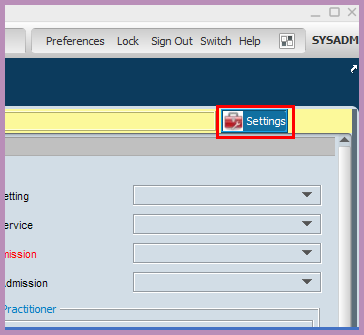
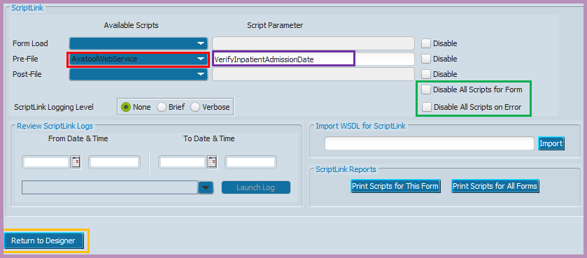

<!-- 220505.110300 -->

# Using ScriptLink

>Last updated: May 5, 2022 by [Chris Banwarth](https://github.com/APrettyCoolProgram)

***

### CONTENTS

[Introduction](#introduction) 
[Creating ScriptLink events](#creating-scriptlink-events) 
[Disabling ScriptLink events](#disabling-scriptlink-events) 

***

# Introduction

When working with web services and myAvatar™, it's inevitable that you will hear about ScriptLink. And depending on who/what is describing what ScriptLink is/does, you are going to get different answers.

## What *is* ScriptLink?

Netsmart tends to use "ScriptLink" as another way to say "custom web services", but that's not really the case. I mean, a "custom web service" is a web service. It's in the name. ScriptLink *isn't* a web service.

As far as I can tell, ScriptLink is simply a *link* to a *script*. Or, more specifically, a *link* to a *web service*. Or, even more specifically, *something that calls a method in a web service* when *something is done with/on a form in myAvatar™*.

To summarize, ScriptLink is essentially a line of code in the form designer that kicks off the magical stuff  in a web service.

# Creating ScriptLink events

To use the a web service with myAvatar™, you will need to add a ScriptLink event to a form event. When that event takes place, myAvatar™ will pass information to that web service (and potentiall recieve something back).

You can add a ScriptLink event to the following form events:
* when the form loads ("Form Load")
* after the submit button is clicked, but prior to filing the form ("Pre-File")
* after the submit button is clicked and the form has been filed ("Post-File")

### What about other form events?
You can also use custom web services with fields and controls, but that is beyond the scope of this documentation.

### Forms that can't use ScriptLink events
There are a small number of forms that you can't use ScriptLink/web services with, and those forms will eventually be listed here.

## Adding a ScriptLink event to a form

Let's say you wanted to have MAWS do something when you hit the **Submit** button on form. To do that you would:
1. Open the **Form Designer** form
2. Choose the myAvatar™ form you want to use from the **Forms** dropdown
3. Choose the form tab from the **Tabs** dropdown
4. Click the **Show Tab** button
5. You will now see the form tab in designer mode. In the upper left of myAvatar™ you will see a **Settings** button:

<h6 align="center">

  
   
  The "Settings" button (again)
   

</h6>

6. Clicking the **Settings** button will bring you to the ScriptLink options page:

<h6 align="center">

  
   
  The ScriptLink options page (again, but this time for something different)
   

</h6>
 

Next we will need to choose an event that will call the Avatool Web Service, and determine the action that will take place. For this example, we will call the *VerifyInpatientAdmissionDate* action on the form's *Pre-File* event:

7. Click the dropdown in the **Pre-File** row under the **Available Scripts** column
8. Choose **AvatoolWebService** (the *red* box)
9. Type "VerifyInpatientAdmissionDate" in the **Pre-File** row under the **Script Parameter** column (the *purple* box)
10. Uncheck the **Disable All Scripts For Form** and **Disable All Scripts on Error** boxes  (the *green* box)
11. Click **Return to Designer** (the *yellow* box), and the ScriptLink options page will close, and you will be back on the **Tab Designer** page
12. Click the **Save** button, and you bw returned to the **Form Designer** page
13. Click **Submit**

Now, when the Admission form is submitted, myAvatar™ will ask MAWS to VerifyInpatientAdmissionDate for a specific client.

# Disabling ScriptLink events

Disabling the functionality of a custom web service is simple and quick, and you can choose to disable individual ScriptLink events, or all ScriptLink events on a form.

In addition, enabling/disabling ScriptLink events does not require any downtime for your environments. The change is made when you hit **Submit**.

To do either of those, you would:
1. Open the **Form Designer** form
2. Choose the myAvatar™ form you want to use from the **Forms** dropdown
3. Choose the form tab from the **Tabs** dropdown
4. Click the **Show Tab** button
5. You will now see the form tab in designer mode. In the upper left of myAvatar™ you will see a **Settings** button:

<h6 align="center">

  
   
  The "Settings" button.
   

</h6>

6. Clicking the **Settings** button will bring you to the ScriptLink options page:

<h6 align="center">

  
   
  The ScriptLink options page.
   

</h6>
 

## Disabling specific ScriptLink events

If you want to disable a specific ScriptLink event:
1. Check the **Disable** boxes  (the *green* box) next to the **Form Load**, **Pre-File** and/or **Post-File** events
2. Click **Return to Designer** (the *yellow* box), and the ScriptLink options page will close, and you will be back on the **Tab Designer** page
3. Click the **Save** button, and you bw returned to the **Form Designer** page
4. Click **Submit**

Now, when the form is submitted, myAvatar™ *will not* process ScriptLink events for the events you have disabled.

## Disabling all ScriptLink events on a form

If you want to disable all ScriptLink events on a form:
1. Check the **Disable All Scripts For Form** and **Disable All Scripts on Error** boxes  (the *green* box)
2. Click **Return to Designer** (the *yellow* box), and the ScriptLink options page will close, and you will be back on the **Tab Designer** page
3. Click the **Save** button, and you bw returned to the **Form Designer** page
4. Click **Submit**

Now, when the Admission form is submitted, myAvatar™ *will not* process *any* scriptlink event on the form.