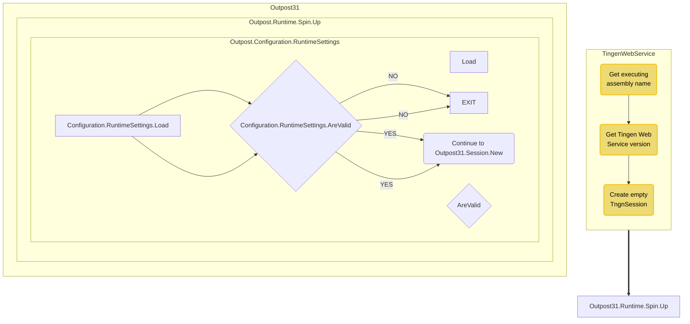
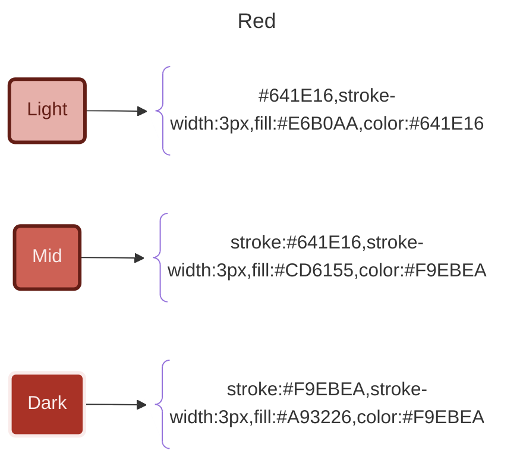
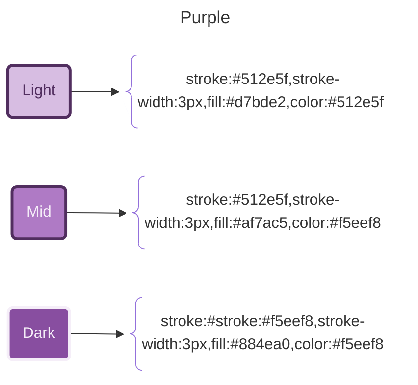
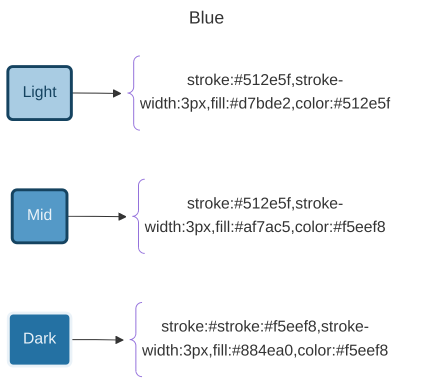
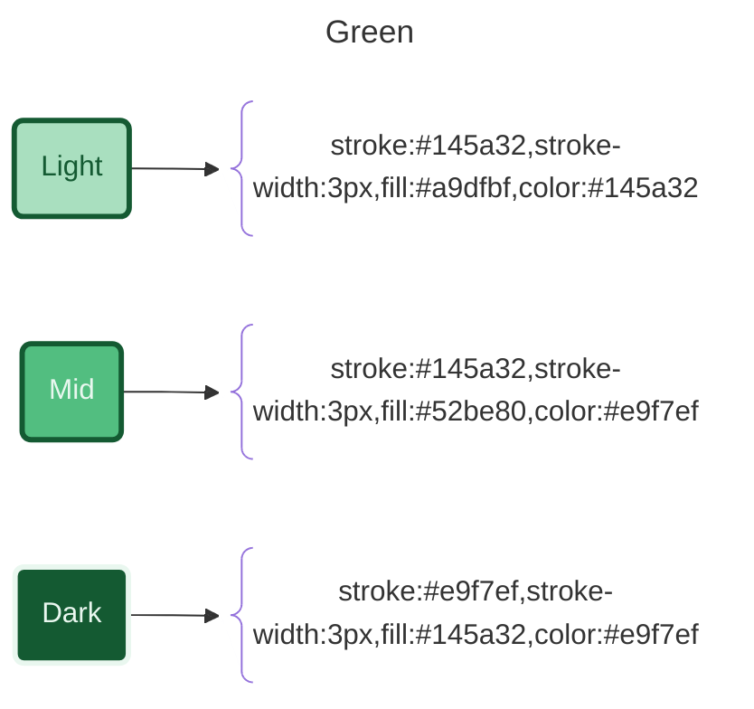
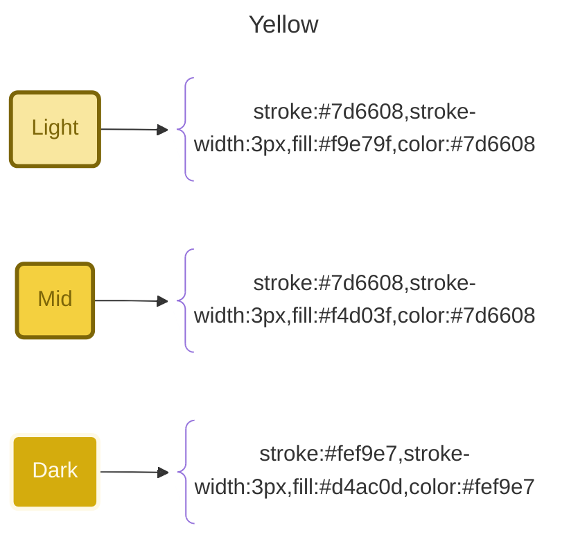
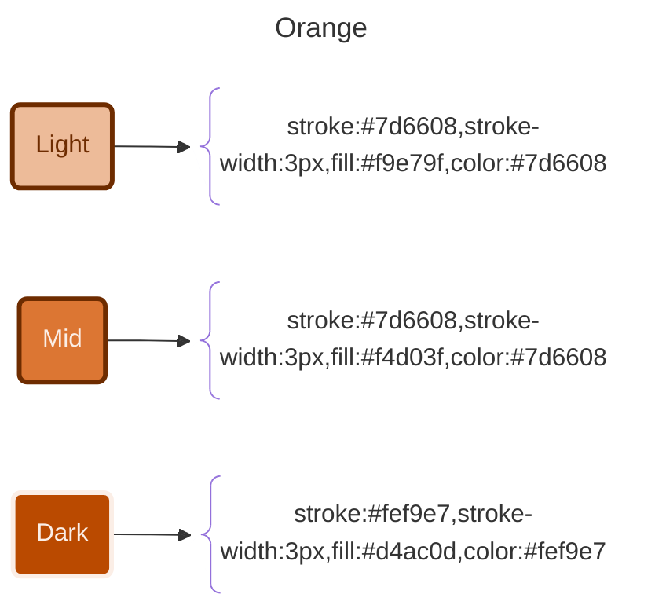
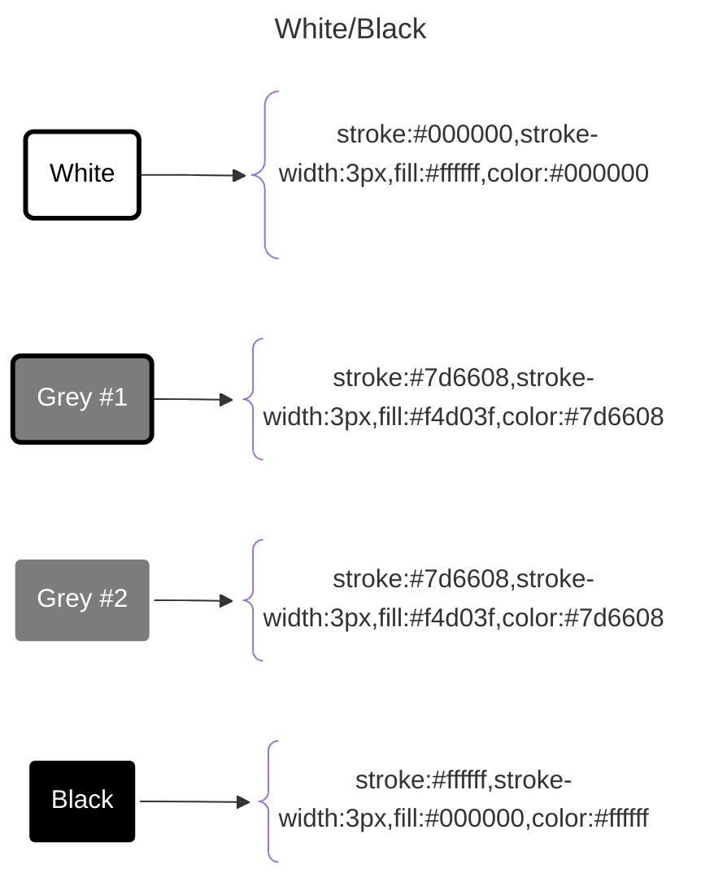

# Tingen Web Service

# FLOW



  GetExecutingAssemblyName --> GetTngnVersion["Get TngnVersion"] --> CreateEmptyTngnSession["Create Empty TngnSession"] --> Outpost31.Runtime.Spin.Up

  subgraph Outpost31.Runtime.Spin.Up
    direction TB
    Configuration.RuntimeSettings.Load --> Configuration.RuntimeSettings.AreValid
    Configuration.RuntimeSettings.AreValid{"Configuration.RuntimeSettings.AreValid"} --NO--> EXIT
    Configuration.RuntimeSettings.AreValid --YES --> Continue_Outpost31.Session.New("Continue to Outpost31.Session.New")
  end

  Outpost31.Runtime.Spin.Up --> Outpost31.Session.New

  subgraph Outpost31.Session.New
    direction TB
    DoSomething --> DoSomethingElse
  end


# SNIPPETS

```
/// <summary>The executing Assembly name.</summary>
/// <remarks>A required component for writing log files, defined here so it can be used throughout the class.</remarks>
public static string ExeAsm { get; set; } = Assembly.GetExecutingAssembly().GetName().Name;
```

```
/* Logging infrastructure hasn't been initialized yet, so if you need to create a log file here, use a Primeval Log.
 */
```

# HEADERS

```
//  ██████  ██  ██ ██████ █████ ██████ █████  ██████   ██████  ███ 
//  ██  ██  ██  ██   ██   █████ ██  ██ ██████   ██        ███   ██ 
//  ██████  ██████   ██   ██    ██████  █████   ██     ██████   ██ 
//                             Outpost31.Core.Avatar.SystemCode.cs
//                                   Logic for Avatar System Codes
// u250227_code
// u250227_documentation
```


# COLORS













