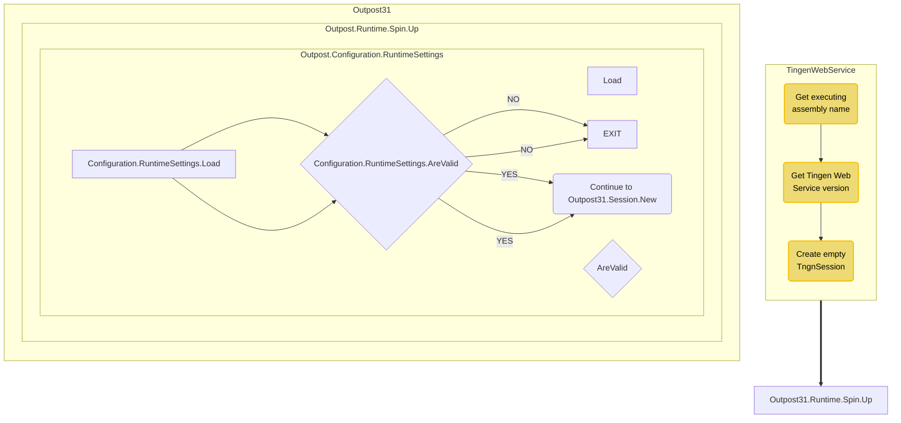

# Tingen Web Service

# FLOW

  GetExecutingAssemblyName --> GetTngnVersion["Get TngnVersion"] --> CreateEmptyTngnSession["Create Empty TngnSession"] --> Outpost31.Runtime.Spin.Up

  subgraph Outpost31.Runtime.Spin.Up
    direction TB
    Configuration.RuntimeSettings.Load --> Configuration.RuntimeSettings.AreValid
    Configuration.RuntimeSettings.AreValid{"Configuration.RuntimeSettings.AreValid"} --NO--> EXIT
    Configuration.RuntimeSettings.AreValid --YES --> Continue_Outpost31.Session.New("Continue to Outpost31.Session.New")
  end

  Outpost31.Runtime.Spin.Up --> Outpost31.Session.New

  subgraph Outpost31.Session.New
    direction TB
    DoSomething --> DoSomethingElse
  end
