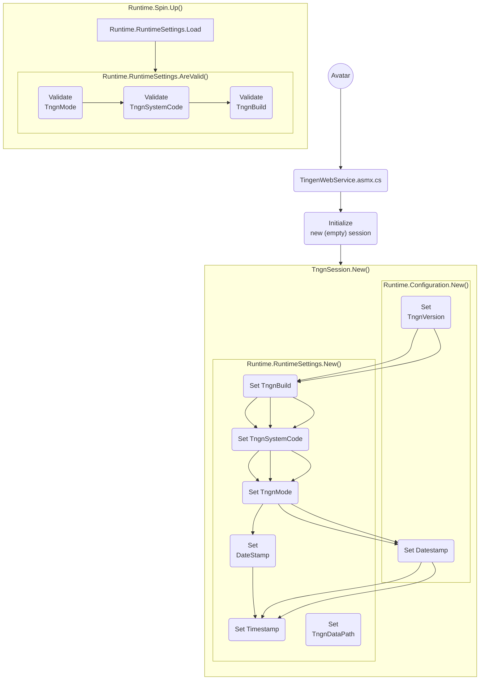

# Tingen Web Service

```mermaid


flowchart TB
  %% Components
  Avatar@{shape: circ, label: "Avatar"}
  TingenWebService.asmx.cs@{shape: rounded, label: "TingenWebService.asmx.cs"}
  InitNewSession@{shape: rounded, label: "Initialize\nnew (empty) session"}

  %% Subgraph - TngnSession.New
  subgraph TngnSession.New ["TngnSession.New()"]
    direction TB

    %% Subgraph - Runtime.RuntimeSettings.New
    subgraph Runtime.RuntimeSettings.New ["Runtime.RuntimeSettings.New()"]
      direction LR

      %% Components
      SetBuild@{shape: rounded, label: "Set\nTngnBuild"}
      SetSystemCode@{shape: rounded, label: "Set\nTngnSystemCode"}
      SetTngnDataPath@{shape: rounded, label: "Set\nTngnDataPath"}
      SetMode@{shape: rounded, label: "Set\nTngnMode"}
      SetDateStamp@{shape: rounded, label: "Set\nDateStamp"}
      SetTimeStamp@{shape: rounded, label: "Set\nTimeStamp"}

      %% Layout
      SetBuild --> SetSystemCode --> SetMode --> SetDateStamp --> SetTimeStamp
    
    end
    %% Subgraph - Runtime.RuntimeSettings.New

    subgraph TngnConfiguration.New ["Runtime.Configuration.New()"]
      direction LR
      %%SetVersion@{shape: rounded, label: "Set\nTngnVersion"}
      %%SetBuild@{shape: rounded, label: "Set\nTngnBuild"}
      %%SetSystemCode@{shape: rounded, label: "Set\nngnSystemCode"}
      %%SetMode@{shape: rounded, label: "Set\nTngnMode"}
      SetVersion --> SetBuild@{shape: rounded, label: "Set TngnBuild"} --> SetSystemCode@{shape: rounded, label: "Set TngnSystemCode"} --> SetMode@{shape: rounded, label: "Set TngnMode"} --> SetDatestamp@{shape: rounded, label: "Set Datestamp"} --> SetTimeStamp@{shape: rounded, label: "Set Timestamp"}
    end

    SetVersion@{shape: rounded, label: "Set\nTngnVersion"}
    SetBuild@{shape: rounded, label: "Set\nTngnBuild"}
    SetSystemCode@{shape: rounded, label: "Set\nngnSystemCode"}
    SetMode@{shape: rounded, label: "Set\nTngnMode"}
    SetDatestamp@{shape: rounded, label: "Set\nDatestamp"}
    SetTimeStamp@{shape: rounded, label: "Set\nTimestamp"}

    SetVersion --> SetBuild@{shape: rounded, label: "Set TngnBuild"} --> SetSystemCode@{shape: rounded, label: "Set TngnSystemCode"} --> SetMode@{shape: rounded, label: "Set TngnMode"} --> SetDatestamp@{shape: rounded, label: "Set Datestamp"} --> SetTimeStamp@{shape: rounded, label: "Set Timestamp"}

  end 
  %% Subgraph - TngnSession.New

  subgraph Runtime.Spin.Up ["Runtime.Spin.Up()"]
    direction TB


  
    subgraph Runtime.RuntimeSettings.AreValid ["Runtime.RuntimeSettings.AreValid()"]
      direction LR
      ValidateMode@{shape: rounded, label: "Validate\nTngnMode"}
      ValidateSystemCode@{shape: rounded, label: "Validate\nTngnSystemCode"}
      ValidateBuild@{shape: rounded, label: "Validate\nTngnBuild"}

      ValidateMode@{shape: rounded, label: "Validate\nTngnMode"} --> ValidateSystemCode@{shape: rounded, label: "Validate\nTngnSystemCode"} --> ValidateBuild@{shape: rounded, label: "Validate\nTngnBuild"}
    end 
  
    Runtime.RuntimeSettings.Load --> Runtime.RuntimeSettings.AreValid

  end 

  Avatar --> TingenWebService.asmx.cs --> InitNewSession
  InitNewSession --> TngnSession.New


```