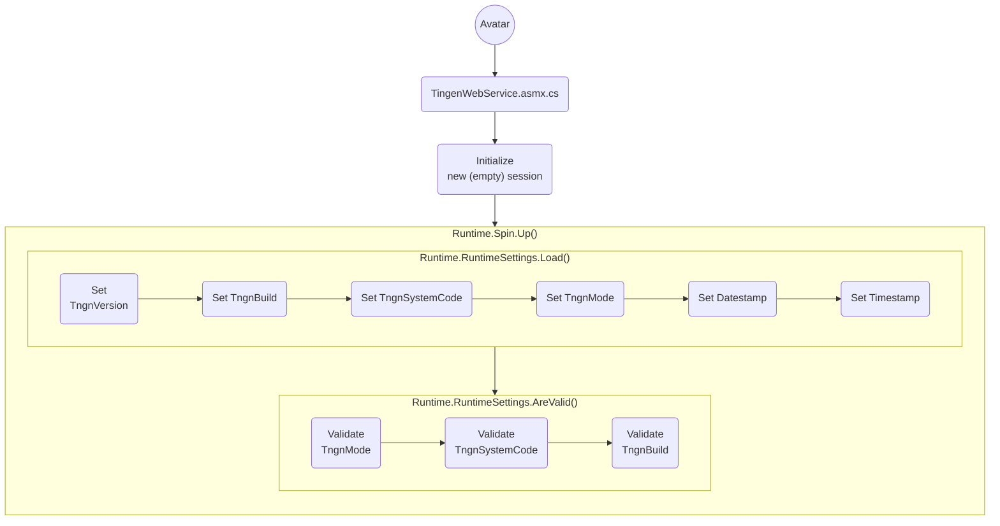

# Tingen Web Service

```mermaid


flowchart TB

  Avatar@{shape: circ, label: "Avatar"}
  TingenWebService.asmx.cs@{shape: rounded, label: "TingenWebService.asmx.cs"}
  InitNewSession@{shape: rounded, label: "Initialize\nnew (empty) session"}
  Avatar --> TingenWebService.asmx.cs --> InitNewSession

  subgraph Runtime.Spin.Up ["Runtime.Spin.Up()"]
    direction TB

    subgraph Runtime.RuntimeSettings.Load ["Runtime.RuntimeSettings.Load()"]
      direction LR
      SetVersion@{shape: rounded, label: "Set\nTngnVersion"}
      SetBuild@{shape: rounded, label: "Set\nTngnBuild"}
      SetSystemCode@{shape: rounded, label: "Set\nngnSystemCode"}
      SetMode@{shape: rounded, label: "Set\nTngnMode"}
      SetDatestamp@{shape: rounded, label: "Set\nDatestamp"}
      SetTimeStamp@{shape: rounded, label: "Set\nTimestamp"}

      SetVersion --> SetBuild@{shape: rounded, label: "Set TngnBuild"} --> SetSystemCode@{shape: rounded, label: "Set TngnSystemCode"} --> SetMode@{shape: rounded, label: "Set TngnMode"} --> SetDatestamp@{shape: rounded, label: "Set Datestamp"} --> SetTimeStamp@{shape: rounded, label: "Set Timestamp"}
    end 
  
    subgraph Runtime.RuntimeSettings.AreValid ["Runtime.RuntimeSettings.AreValid()"]
      direction LR
      ValidateMode@{shape: rounded, label: "Validate\nTngnMode"}
      ValidateSystemCode@{shape: rounded, label: "Validate\nTngnSystemCode"}
      ValidateBuild@{shape: rounded, label: "Validate\nTngnBuild"}

      ValidateMode@{shape: rounded, label: "Validate\nTngnMode"} --> ValidateSystemCode@{shape: rounded, label: "Validate\nTngnSystemCode"} --> ValidateBuild@{shape: rounded, label: "Validate\nTngnBuild"}
    end 
  
    Runtime.RuntimeSettings.Load --> Runtime.RuntimeSettings.AreValid

  end 

  InitNewSession --> Runtime.Spin.Up


```