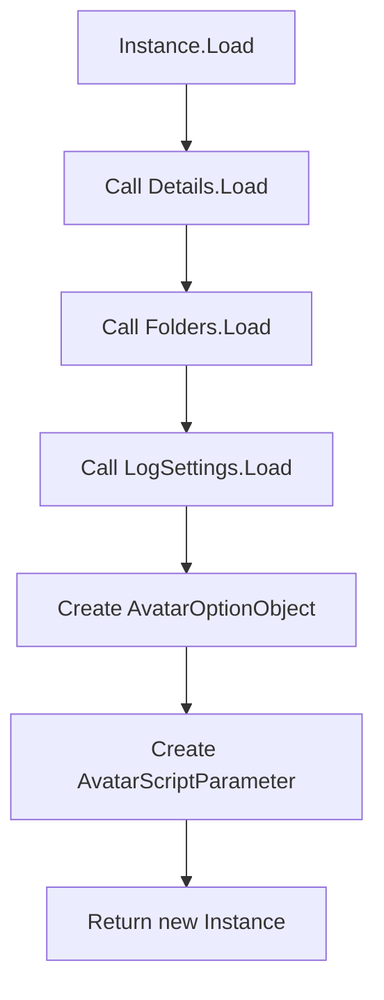
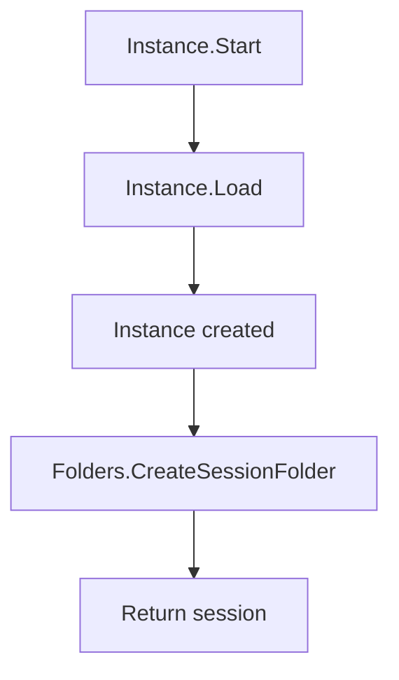
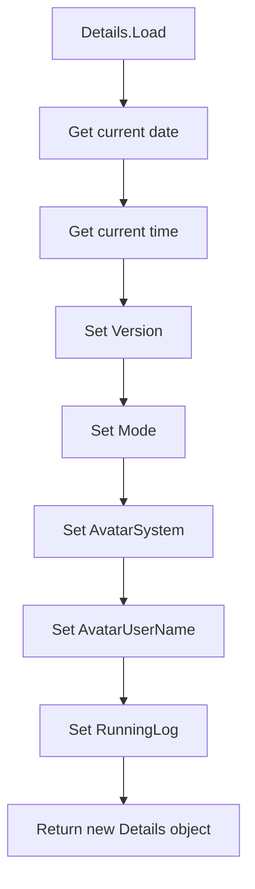

<!-- u251002 -->

[[🏠︎](../../README.md)] ❬ [Static documentation](../README.md) ❬ [Diagrams](README.md)

  <picture>
    <source media="(prefers-color-scheme: dark)" srcset="https://github.com/spectrum-health-systems/tingen-projects/blob/main/logos/tngndocs-dark-400x63.png">
    <source media="(prefers-color-scheme: light)" srcset="https://github.com/spectrum-health-systems/tingen-projects/blob/main/logos/tngndocs-light-400x63.png">
    
  </picture>
  <h1>
    Diagram ❭ NS:Outpost31.TngnWsvcSession
  </h1>

### CONTENTS

* Instance.cs  
  * [Instance.Load()](#instanceload)  
  * [Instance Start()](#instancestart)  
* Detail.cs  
  * [Detail.Load()](#detailload)

***

# Instance.cs

## Instance.Load()

> Last updated 9/24/25

## Instance.Start()

> Last updated 9/24/25

# Detail.cs

## Detail.Load()

> Last updated 9/24/25

