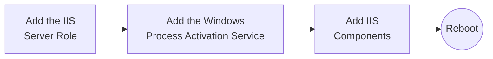
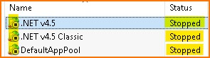
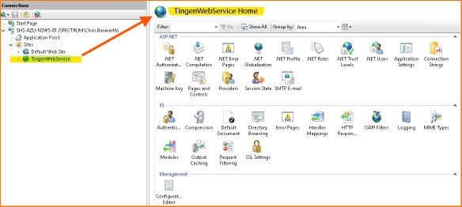
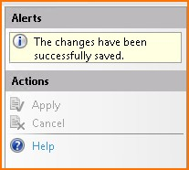

<!-- u250818 -->

[[🏠︎](/README.md)] ❬ [Tingen Manuals](../README.md) ❬ [Tingen Web Service Manual](./README.md)

<div align="center">

  

## Hosting the Tingen Web Service using Microsoft IIS

</div>

***

### CONTENTS

* [Overview](#overview)
* [Installing IIS](#installing-iis)
* [Setting up IIS](#setting-up-iis)
* [Hosting the Tingen Web Service using IIS]()

***

# Overview

In order to use any web service that interfaces with myAvatar™, that web service needs to be ***hosted*** at a location that myAvatar™ has access to

There are two options for hosting a custom web service:

1. **Have Netsmart host your custom web service**<br>
If your myAvatar™ environments are hosted by Netsmart, they can also host your custom web services. If you choose to have Netsmart host your custom web service, you can skip the rest of this document and contact them to set things up.

2. **Self-host your custom web service**<br>
If you self-host your myAvatar™ environments, or would rather have complete control over your custom web services, you can self-host them. This document will walk you through the process of doing that.

## Using Microsoft IIS to host a custom web service

You can probably host your custom web service using many web server/operating systems combinations, but these guidelines will focus on getting setup on Microsoft IIS.

These are the steps that I use to host a the Tingen Web Service, but they are more of a *guideline* than a perfect set of instructions. It's quite possible that I didn't follow best-practices, or maybe I have something setup incorrectly, so please use caution when following these steps.

## PLEASE NOTE

* This document assumes that you already have a IIS up and running.
* Keep in mind that myAvatar™ can only communicate with web services via the *HTTPS* protocol.

# Installing Microsoft IIS

If you need to install Microsoft IIS from scractch, follow [these instructions](https://github.com/APrettyCoolProgram/apcp/blob/main/docproj/how/setup-iis/README.md).

# Setting up IIS



This is what a fresh installation of IIS should look like:

<div align="center">

  

</div>

## Applications Pools

### Disabling the current Application Pools

Since we are going to be creating a new Application Pool, we can disable those that were installed with IIS.

<div align="center">

  

</div>

To do this, **right click** on the following Application Pools (hightlighted yellow), then choose **Stop**

* .NET v4.5
* .NET v4.5 Classic
* DefaultAppPool

The Application Pools should now look like this:

<div align="center">

  

</div>

### Creating an new Application Pool

From within IIS:

1. Right-click the **Application Pools** connection
2. Choose **Add Application Pool…**
3. Name the Application Pool `Tingen_WebService`
4. Verify everything looks like this:

<div align="center">

  

</div>

5. Click ***OK***
6. Verify that the new Application Pool is listed, and has started:

<div align="center">

  

</div>

# Sites

## Disabling the current site

Since we are going to be creating a new Site, we can disable default site that was installed with IIS.

<div align="center">

  

</div>

To do this:

1. **Right click** on the *`Default Web Site* (hightlighted yellow)
2. Choose **Manage Website**
3. Choose **Stop**

The Default Web Site should now look like this:

<div align="center">

  

</div>

## Creating a new site

From within IIS:
1. Right-click the **Sites** connection
2. Choose **Add Website**
3. The **Site name** should be: *AvatoolWebService*
4. The **Application pool** should be: *AvatoolWebService*
5. The **Physical path** should be: */path/to/your/files/*
6. In the **Binding > Type** dropdown, choose ***https***
7. Click the **Select...** button, and choose a valid certificate to use

This is what the Add Website window should look like:

<div align="center">

  

</div>

8. Click **OK**, and the ***Sites*** tree should look like this:

<div align="center">

  

</div>

## Configuring the new TingenWebService site

We'll want to make sure that we are in the TingenWebService site when configuring:

<div align="center">

  

</div>

### Enable SSL

In the TingenWebService Home:

1. Double-click on the **SSL Settings** icon:

<div align="center">

  

</div>

2. Check the **Require SSL** box
3. On the right-hand side under **Actions**, click **Apply**

<div align="center">

  

</div>

The SSL Settings should now look like this:

<div align="center">

  

</div>

## Verify the TingenWebService Site is secure

In the TingenWebService Home, click on **Browse *:433 (https)**.

<div align="center">

  

</div>

The following page should open in a browser:

<div align="center">

  

</div>

# Creating the `LIVE` Application

## Create the `Tingen_WebService\LIVE` folder

Add a folder for `LIVE` to the `C:\Tingen_WebService` folder, like this:

<div align="center">

  

</div>

## Create a test web page

1. Create a file named `test-page.html` with the following content:

```text
Hello World!
```

2. Save that file to `C:\Tingen_WebService\LIVE`

## Converting `TingenWebService\LIVE` to an Application

In IIS, folders look like...uh...folders, and Applications look like the symbol next to `UAT`

<div align="center">

  

</div>

`UAT` looks like that because I've already converted it to an Application, which is what we are going to do with `LIVE` now.

1. **Right-click** on `LIVE` under ***Sites > TingenWebService***
2. Choose **Convert to Application**

The ***Add Application*** window should look like this:

<div align="center">

  

</div>

3. Click **OK**

## Enable directory Browsing

> [!TIP]  
> If the web service stops working, this is one of the first things to check!

In the `/LIVE` Home:

1. Double-click on the **Directory Browsing** icon:

<div align="center">

  

</div>

On the right-hand side under **Actions**, click **Enable**

<div align="center">

  

</div>

2. Click **Enable**

The browsing functionality should now look like this:

<div align="center">

  

</div>

## Give the `IIS AppPool\Tingen_WebService` user access

The `IIS AppPool\Tingen_WebService` needs read access to everything in the c:\Tingen_WebService folder

## Give the `%ServerName%\IIS_IUSRS` user access

The `%ServerName%\IIS_IUSRS` needs read access to everything in the c:\Tingen_WebService folder

## Give the `%ServerName%\IIS_IUSRS` user access

The `%ServerName%\IIS_IUSRS` needs read access to everything in the c:\Tingen_WebService folder

## Modify the Anonymous Authentication settings

1. Click the **Tingen_WebServices** Site

2. Click the **Authentication** icon

3. **Right-click** the ***Anonymous Authentication*** option

4. Change the ***User Identity*** to **Application Pool**

# Test the `LIVE` application

In the /LIVE Home, click the **Browse *:443 (https)** link

The following page should open in a browser:

<div align="center">

  

</div>

Clicking on **test-page.html** should display this page:

<div align="center">

  

</div>

# Creating the `UAT` Application

Follow the same steps above to create the `UAT` Application

***

[[🏠︎](/README.md)] ❬ [Tingen Manuals](../README.md) ❬ [Tingen DevDeploy Manual](./README.md)