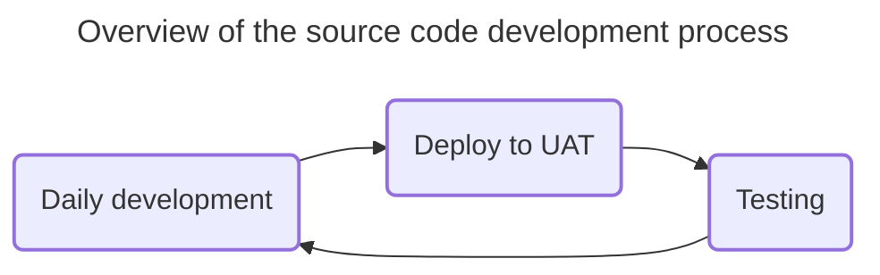

<!-- u250114 -->

> Last updated: January 14, 2025

<div align="center">


 <h1>Tingen Development Process</h1>

</div>

## CONTENTS

[Daily development](#daily-development)  
[Monthly development](#monthly-development)

# Daily development



## Starting a new daily development session

### 1. Update file headers

Update the file headers for the following files:

* Tingen.Tingen.asmx.cs
* Outpost31.WelcomeToOutpost31.cs

### 2. Update the `tnBuild` value

Update `tnBuild` value in `Core.Session.TingenSession.BuildStaticVars()` to the current `YYMMDD.HHMM` value.

For example:

```csharp
return new Dictionary<string, string>
{
    { "tnBuild",              "241205.0944" },
    { "avSystemCode",         "UAT" },
    { "tnDataRoot",           @"C:\TingenData" },
    { "tnConfigFileName",     "Tingen.config" },
    { "ntstSecurityFileName", "NtstSecurity.config" }
};
```

# Monthly development

These are the steps to create a new monthly development build of Tingen.

## 1. Update the AutoHotKey script

Update the following components of the AutoHotkey script:

* ALT+CTRL+SHIFT+P
* ALT+CTRL+SHIFT+R
* ALT+CTRL+SHIFT+V
## 2. Archive current repository branches

  Create a `YY.DD.##-development+final` branch for each of the following repositories:

* Tingen_development
* Outpost31
* Tingen-Documentation
# 3. Update the AssemblyInfo.cs files

  Update the following `AssemblyInfo.cs` files with the current version number:

* Tingen_development/Properties/AssemblyInfo.cs
* Outpost31/Properties/AssemblyInfo.cs
* 
## 4. Update file headers

Update the file headers for the following files:

* Tingen.Tingen.asmx.cs
* Outpost31.WelcomeToOutpost31.cs

## 5. Update the `tnBuild` value

Update `tnBuild` value in `Core.Session.TingenSession.BuildStaticVars()` to the current `YYMMDD.HHMM` value.

For example:

```csharp
return new Dictionary<string, string>
{
    { "tnBuild",              "241205.0944" },
    { "avSystemCode",         "UAT" },
    { "tnDataRoot",           @"C:\TingenData" },
    { "tnConfigFileName",     "Tingen.config" },
    { "ntstSecurityFileName", "NtstSecurity.config" }
};
```

## 6. Update the documentation

Search for the following string in the documentation...

```markdown

```

...where `YY.MM` is the Year.Month value for the current documentation, and keeping in mind that the "***%20***" in "**%20***MM*" is a space!

Replace the value of `YY.MM` with the current Year.Month.

For example:

```markdown

```

## 7. Update the Sandcastle help file versions

Update the Sandcastle "Help file version" in the following Sandcastle profiles:

* Tingen
* Outpost31
