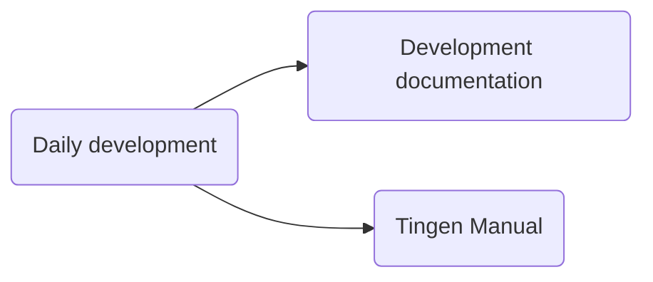
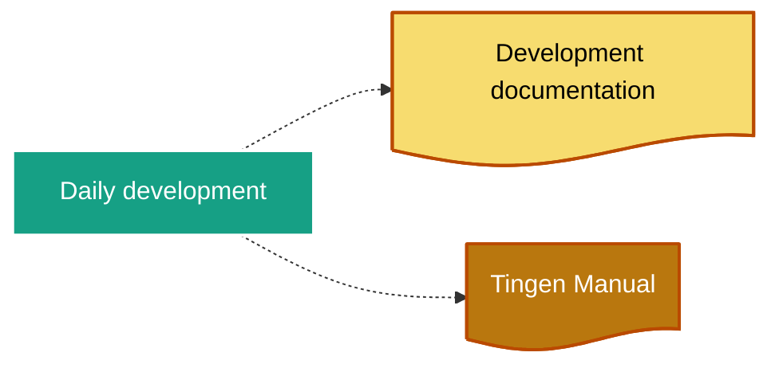

<!-- u250107 -->

> [!info] Last updated: January 7, 2025
# Daily development

## Source code development

```mermaid
flowchart LR
  DailyDevelopment("Daily development") --> DeployToUAT("Deploy to UAT")
  DeployToUAT --> Testing("Testing") 
  Testing --> DailyDevelopment

  classDef nodes stroke-width:2px;
  class DailyDevelopment, DeployToUat, Testing nodes;
```

## Documentation development




  

## Development documentation

  



  

# Daily Development

  

When development starts for the day:

  

## 1. Update file headers

  

Update the file headers for both `Tingen.Tingen.asmx.cs` and `Outpost31.WelcomeToOutpost31.cs` with the current the datestamp information:

  

For example:

  

```text

// ================================================================ 241031 =====

```

  

## 2. Update the tnBuild value

  

Update `tnBuild` value in `Core.Session.TingenSession.BuildStaticVars()` to the current `HHMM` value.

  

For example:

  

```csharp

return new Dictionary<string, string>

{

    { "tnBuild",              "0919" },

    { "avSystemCode",         "UAT" },

    { "tnDataRoot",           @"C:\TingenData" },

    { "tnConfigFileName",     "Tingen.config" },

    { "ntstSecurityFileName", "NtstSecurity.config" }

};

```