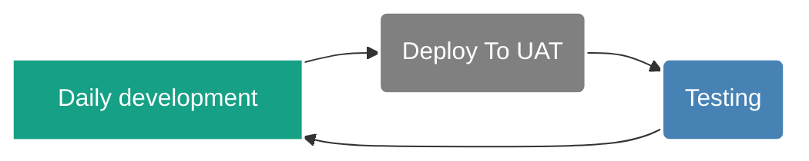
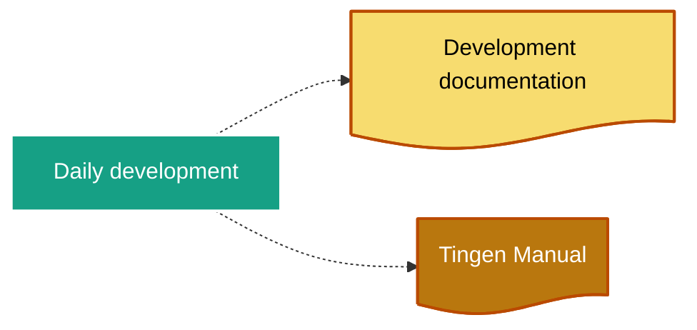

<!-- u241104 -->

<div align="center">

  

  

  <h1>
    Tingen daily development
  </h1>

</div>

# Overview



## Development documentation



# Daily Development

When development starts for the day:

## 1. Update file headers

Update the file headers for both `Tingen.Tingen.asmx.cs` and `Outpost31.WelcomeToOutpost31.cs` with the current the datestamp information:

For example:

```text
// ================================================================ 241031 =====
```

## 2. Update the tnBuild value

Update `tnBuild` value in `Core.Session.TingenSession.BuildStaticVars()` to the current `HHMM` value.

For example:

```csharp
return new Dictionary<string, string>
{
    { "tnBuild",              "0919" },
    { "avSystemCode",         "UAT" },
    { "tnDataRoot",           @"C:\TingenData" },
    { "tnConfigFileName",     "Tingen.config" },
    { "ntstSecurityFileName", "NtstSecurity.config" }
};
```
