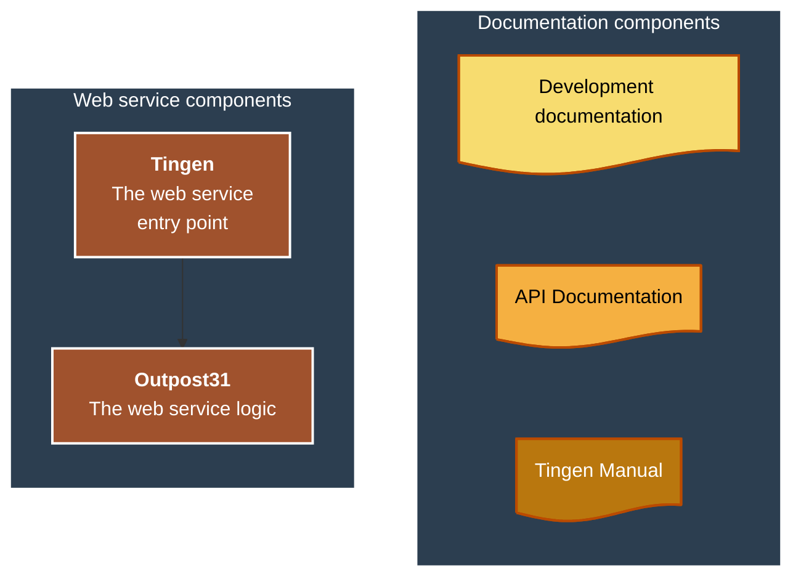
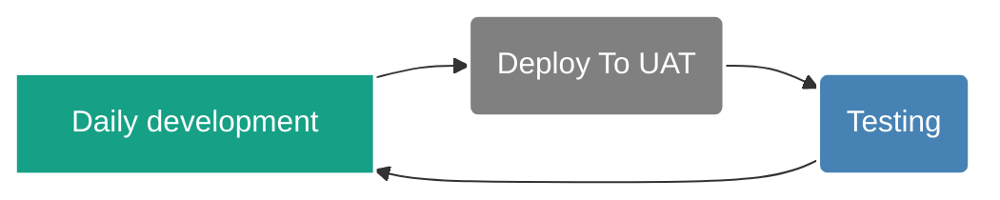
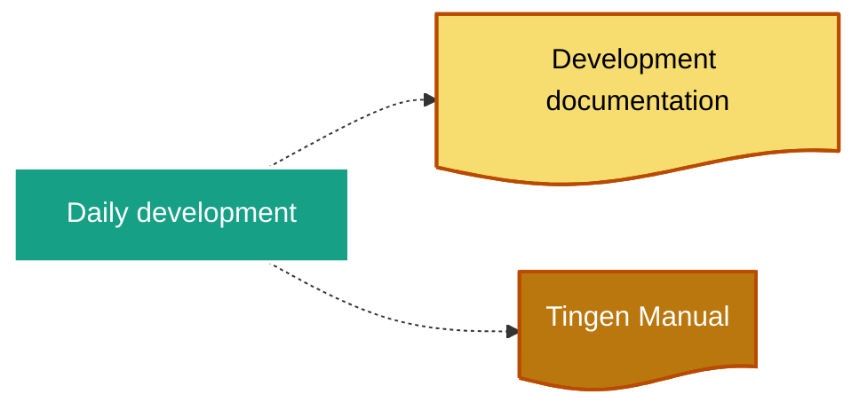
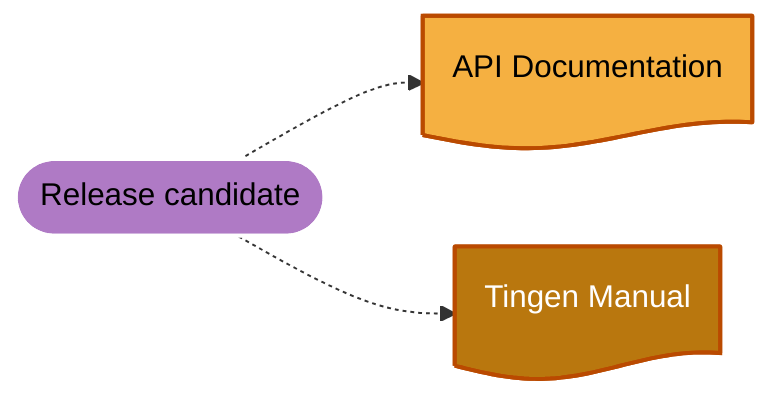
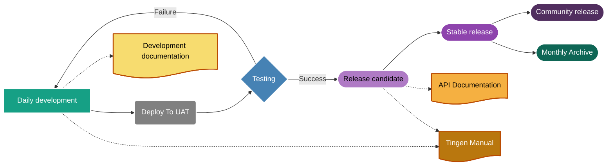

<!-- u241104 -->

<div align="center">

  

  

  <h1>
    Tingen development processes
  </h1>

</div>

# Overview

This is an overview of the Tingen development process.

# Tingen development

The Tingen web service is comprised of the following components:



## Development timelines

### Daily development



### Release candidates


### Stable releases


### Community releases


### Monthly archives


# Documentation process

## Development documentation



## Release candidate documentation



## Development process

Development of Tingen.



# Daily Development

When development starts for the day:

## 1. Update file headers

Update the file headers for both `Tingen.Tingen.asmx.cs` and `Outpost31.WelcomeToOutpost31.cs` with the current the datestamp information:

For example:

```text
// ================================================================ 241031 =====
```

## 2. Update the tnBuild value

Update `tnBuild` value in `Core.Session.TingenSession.BuildStaticVars()` to the current `HHMM` value.

For example:

```csharp
return new Dictionary<string, string>
{
    { "tnBuild",              "0919" },
    { "avSystemCode",         "UAT" },
    { "tnDataRoot",           @"C:\TingenData" },
    { "tnConfigFileName",     "Tingen.config" },
    { "ntstSecurityFileName", "NtstSecurity.config" }
};
```

# Monthly development

When development starts for a new month:

## 1. Archive current Tingen_development branch

Create a `YY.DD.##-development+final` branch of Tingen_development using the current development branch.

## 2. Archive current Outpost31 development branch

Create a `YY.DD.##-development+final` branch of Outpost31 using the current development branch.

## 3. Archive the documentation

Create a `YY.DD.##-development+final` branch of Tingen-Documentation using the current development branch.

# 4. Update the AssemblyInfo.cs files

Update the following AssemblyInfo.cs files with the current version number:

- Tingen_development/Properties/AssemblyInfo.cs
- Outpost31/Properties/AssemblyInfo.cs

## 5. Update file headers

Update the file headers for both `Tingen.Tingen.asmx.cs` and `Outpost31.WelcomeToOutpost31.cs` with the current the datestamp information:

For example:

```text
// ================================================================ 241031 =====
```

## 56 Update the tnBuild value

Update `tnBuild` value in `Core.Session.TingenSession.BuildStaticVars()` to the current `HHMM` value.

For example:

```csharp
return new Dictionary<string, string>
{
    { "tnBuild",              "0919" },
    { "avSystemCode",         "UAT" },
    { "tnDataRoot",           @"C:\TingenData" },
    { "tnConfigFileName",     "Tingen.config" },
    { "ntstSecurityFileName", "NtstSecurity.config" }
};
```

# 7. Update the documentation

Search for the following string in the documentation...

```

```

...where `YYYY.MM` is the Year.Month value for the current documentation.

Replace the value of `YYYY.MM` with the current Year.Month.

# 8. Update the AutoHotKey script

# 9. Update the Sandcastle help file versions

Update the Sandcastle "Help file version" in the following Sandcastle profiles:

- Tingen
- Outpost31