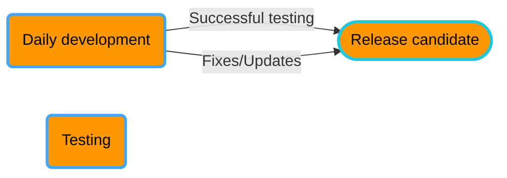

<!-- u250114 -->

> Last updated: January 14, 2025

 <h1>Releases</h1>

There are five types of Tingen releases:

- [Development](#development)
- [Testing](#testing)
- [Release](#release)
- [Stable](#stable)
- [Community](#community)

# Development

TBD

# Testing

TBD

# Release

# Stable

TBD

# Community

- December 20: Abatab WinterYY
- March 20: Abatab SpringYY
- June 20: Abatab SummerYY
- September 20: Abatab AutumnYY

For example: `Abatab Autumn23`