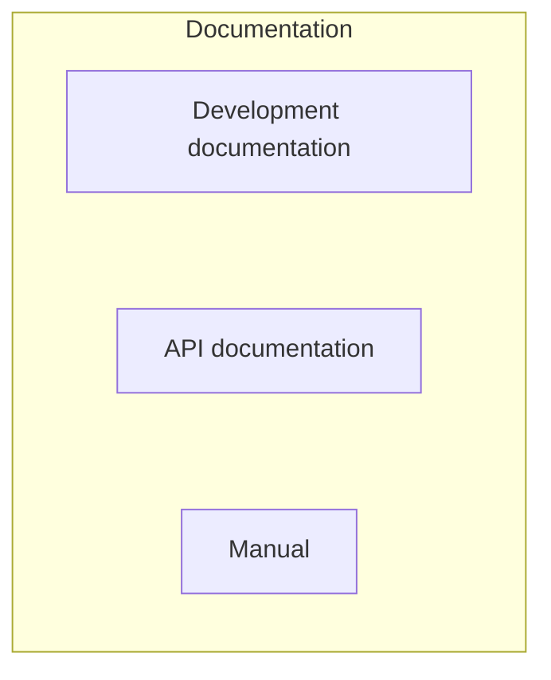
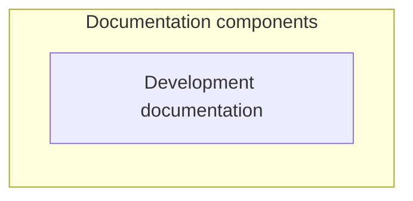
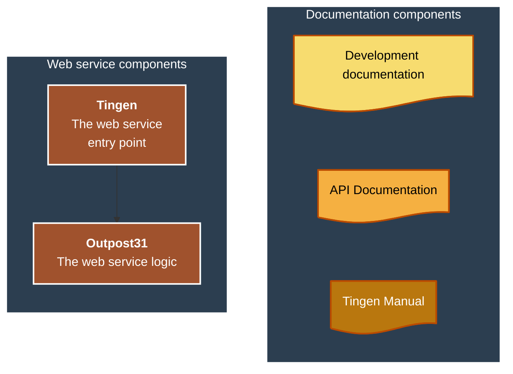

# Tingen Development Processes

## Components

```mermaid
flowchart LR
  subgraph Documentation
    direction TB
	  DevelopmentDocumentation["Development documentation"] ~~~
      ApiDocumentation["API documentation"]
      Manual["Manual"]
      DevelopmentDocumentation ~~~ ApiDocumentation ~~~ Manual
  end

  classDef allNodes stroke-width:2px;
  class DailyDevelopment,DeployToUat,Testing allNodes;
```

```mermaid
flowchart TB
    subgraph Documentation["Documentation components"]
	    direction TB
		DevelopmentDocumentation["Development documentation"]
    end
```

```mermaid
flowchart TB
  subgraph DocumentationComponents["Documentation components"]
      direction TB
      %% Components
      DevelopmentDocumentationComponent@{shape: doc, label: "Development documentation"}
      ApiDocumentationComponent@{shape: doc, label: "API Documentation"}
      ManualComponent@{shape: doc, label: "Tingen Manual"}
      %% Layout
      DevelopmentDocumentationComponent ~~~ ApiDocumentationComponent ~~~ ManualComponent
  end
  subgraph WebServiceComponents["Web service components"]
      direction TB
      %% Components
      TingenComponent@{shape: rect, label: "**Tingen**<br/>The web service<br/>entry point"}
      Outpost31Component@{shape: rect, label: "**Outpost31**<br/>The web service logic"}
      %% Layout
      TingenComponent --> Outpost31Component
  end
  %% Styles #f7dc6f #f5b041 #b9770e
  style WebServiceComponents color:#FFF,fill:#2c3e50,stroke:#FFF,stroke-width:2px
  style TingenComponent color:#FFF,fill:sienna,stroke:#FFF,stroke-width:2px
  style Outpost31Component color:#FFF,fill:sienna,stroke:#FFF,stroke-width:2px
  style DocumentationComponents color:#FFF,fill:#2c3e50,stroke:#FFF,stroke-width:2px
  style DevelopmentDocumentationComponent color:#000,fill:#f7dc6f,stroke:#ba4a00,stroke-width:2px
  style ApiDocumentationComponent color:#000,fill:#f5b041,stroke:#ba4a00,stroke-width:2px
  style ManualComponent color:#FFF,fill:#b9770e,stroke:#ba4a00,stroke-width:2px
  %% Links 
  click TingenComponent "https://github.com/spectrum-health-systems/Tingen_development"
  click Outpost31Component "https://github.com/spectrum-health-systems/Outpost31"
```

