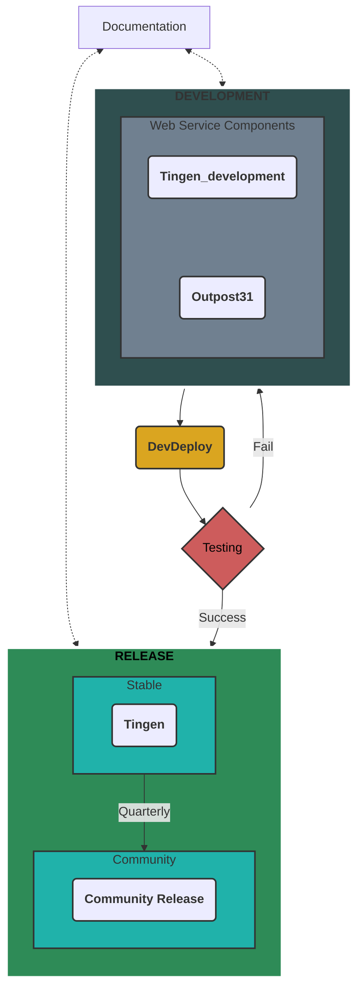

## Tingen development/release process

```mermaid
flowchart TB
  Documentation <-.-> Development
  Documentation <-.-> Release
  subgraph Development["`**DEVELOPMENT**`"]
    direction TB
      subgraph WebServiceComponents["Web Service Components"]
        direction TB
        TingenDevelopment("`**Tingen_development**`") ~~~ Outpost31("`**Outpost31**`") 
      end     
  end
    Development --> DevDeploy("`**DevDeploy**`") --> Testing{"Testing"}
    Testing -- Fail --> Development
    Testing -- Success --> Release
  subgraph Release["`**RELEASE**`"]
    direction TB
      subgraph Stable["Stable"]
        Tingen("`**Tingen**`")
      end
      subgraph Community["Community"]
        CommunityRelease("`**Community Release**`")
      end   
  end
  Stable -- Quarterly --> Community

  style Development fill:darkslategrey,stroke:#FFFFFF,stroke-width:4px
  style WebServiceComponents fill:slategrey,stroke:#333,stroke-width:2px
  style TingenDevelopment fill:000000,stroke:#333,stroke-width:2px
  style Outpost31 fill:000000,stroke:#333,stroke-width:2px
  style DevDeploy fill:goldenrod,stroke:#333,stroke-width:2px        
  style Testing fill:indianred,stroke:#333,stroke-width:2px,color:#000000 
  style Release fill:seagreen,stroke:#FFFFFF,stroke-width:4px,color:black
  style Stable fill:lightseagreen,stroke:#333,stroke-width:2px
  style Tingen fill:000000,stroke:#333,stroke-width:2px
  style Community fill:lightseagreen,stroke:#333,stroke-width:2px
  style CommunityRelease fill:000000,stroke:#333,stroke-width:2px

  click TingenDocumentation "https://github.com/spectrum-health-systems/Tingen-Documentation"
  click TingenDevelopment "https://github.com/spectrum-health-systems/Tingen_development"
  click Outpost31 "https://github.com/spectrum-health-systems/Outpost31"
  click DevDeploy "https://github.com/spectrum-health-systems/Tingen-DevDeploy"
  click Tingen "https://github.com/spectrum-health-systems/Tingen"
  click CommunityRelease "https://github.com/spectrum-health-systems/Tingen-CommunityRelease"
```