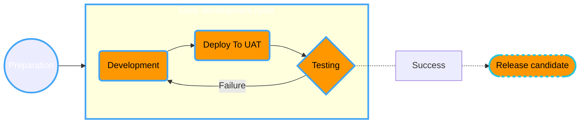

<!-- u250114 -->

> Last updated: January 14, 2025

<div align="center">


 <h1>Daily development</h1>

</div>



## Preparation

### 1. Update file headers

Update the file headers for the following files:

* Tingen.Tingen.asmx.cs
* Outpost31.WelcomeToOutpost31.cs

### 2. Update the `tnBuild` value

Update `tnBuild` value in `Core.Session.TingenSession.BuildStaticVars()` to the current `YYMMDD.HHMM` value.

For example:

```csharp
return new Dictionary<string, string>
{
    { "tnBuild",              "241205.0944" },
    { "avSystemCode",         "UAT" },
    { "tnDataRoot",           @"C:\TingenData" },
    { "tnConfigFileName",     "Tingen.config" },
    { "ntstSecurityFileName", "NtstSecurity.config" }
};
```
