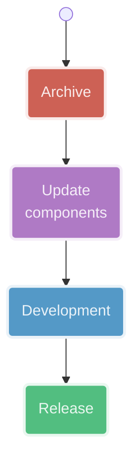
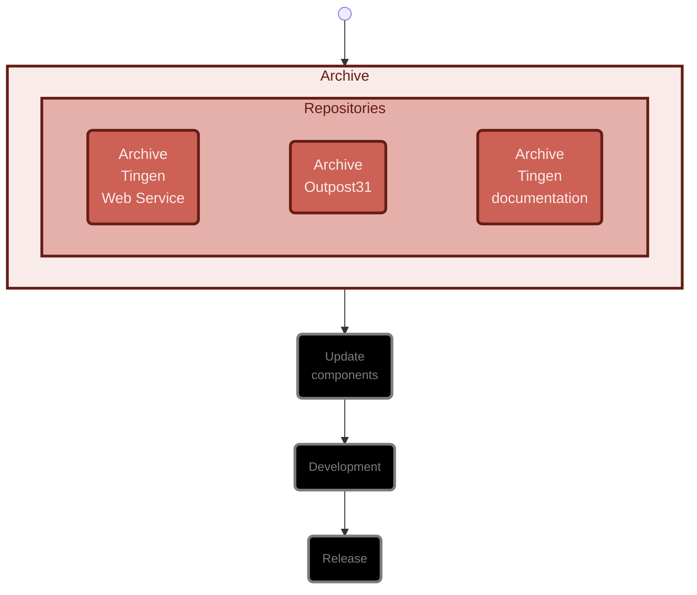
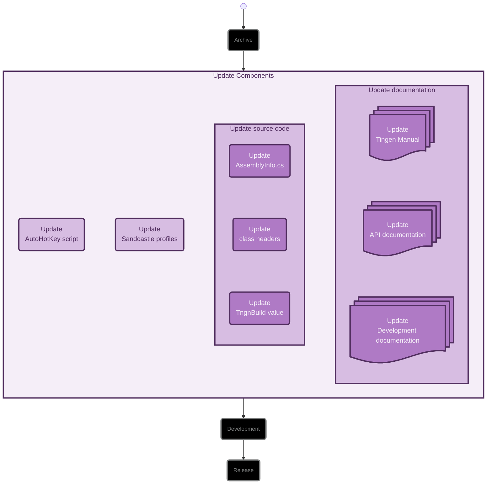
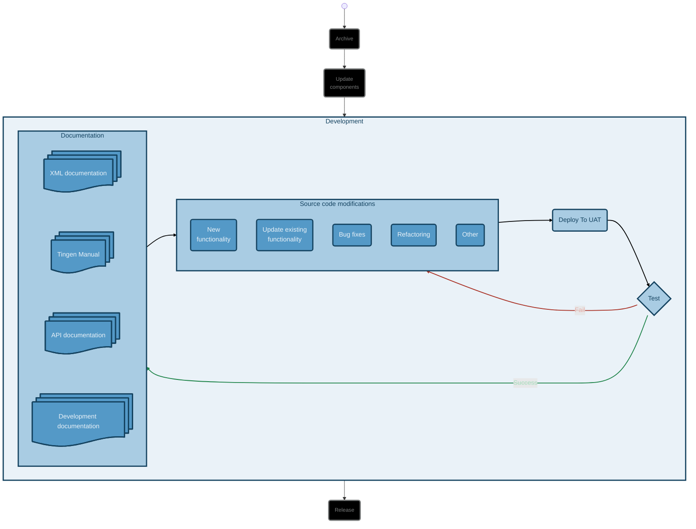
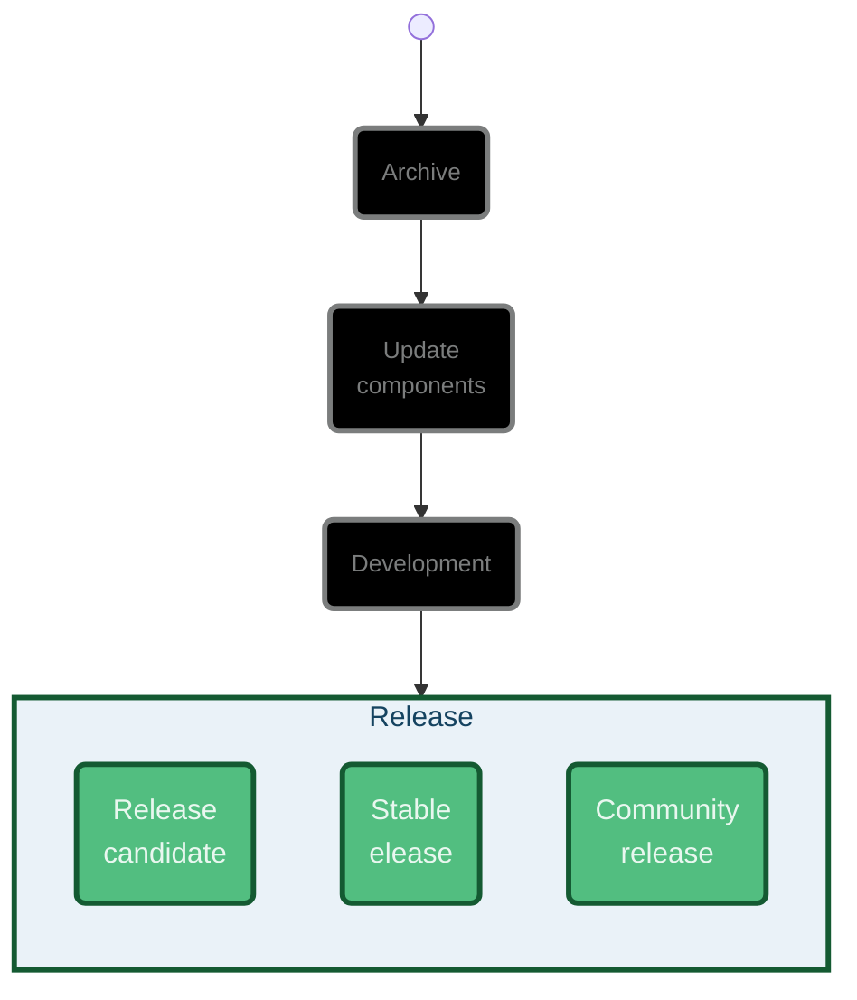

<!-- u250306 -->

<!--
  I'm sure the Mermaid.js code here looks awful, but it was a real pain to get
  all it looking the way it does, so I don't plan on touching it going forward.

  The rest of the document will be updated normally.
-->

> Last updated: March 6, 2025

<div align="center">


  <h1>Development workflows</h1>

</div>

<br>

<div align="center">



</div>

<br>

<!-- ARCHIVE -->

# ARCHIVE

<div align="center">



</div>

## Archive repositories

Create a `YY.DD.##-development+final` branch for each of the following repositories:

* Tingen-WebService
* Outpost31
* Tingen-Documentation

<br>

***

<br>

<!-- UPDATE COMPONENTS -->

# UPDATE COMPONENTS

<div align="center">



</div>

## Update the AutoHotKey script

Update the following components of the AutoHotkey script:

* ALT+CTRL+SHIFT+P
* ALT+CTRL+SHIFT+R
* ALT+CTRL+SHIFT+V
  
## Update Sandcastle profiles

Update the Sandcastle "Help file version" in the following Sandcastle profiles:

* Tingen
* Outpost31

## Update the source code

### AssemblyInfo.cs

Update the following `AssemblyInfo.cs` files with the current version number:

* Tingen_development/Properties/AssemblyInfo.cs
* Outpost31/Properties/AssemblyInfo.cs
  
### Class file headers

Update the file headers for the following files:

* Tingen.Tingen.asmx.cs
* Outpost31.WelcomeToOutpost31.cs

### The `tnBuild` value

Update `tnBuild` value in `Core.Session.TingenSession.BuildStaticVars()` to the current `YYMMDD.HHMM` value.

For example:

```csharp
return new Dictionary<string, string>
{
    { "tnBuild",              "241205.0944" },
    { "avSystemCode",         "UAT" },
    { "tnDataRoot",           @"C:\TingenData" },
    { "tnConfigFileName",     "Tingen.config" },
    { "ntstSecurityFileName", "NtstSecurity.config" }
};
```

## Update the documentation

Search for the following string in the documentation...

```markdown

```

...where `YY.MM` is the Year.Month value for the current documentation, and keeping in mind that the "***%20***" in "**%20***MM*" is a space!

Replace the value of `YY.MM` with the current Year.Month.

For example:

```markdown

```

<br>

***

<br>

<!-- DEVELOPMENT -->

<div align="center">



</div>

## New functionality

## Updating existing functionality

## Bug fixes

## Refactoring

## Other

## Deploying to UAT

## Testing

## Updating XML documentation

## Updating the Tingen Manual

## Updating the API documentation

## Updating the Development documentation

<!-- RELEASE -->

<div align="center">



</div>

## Release candidate

## Stable

## Community

* December 20: Abatab WinterYY
* March 20: Abatab SpringYY
* June 20: Abatab SummerYY
* September 20: Abatab AutumnYY

For example: `Abatab Autumn23`
