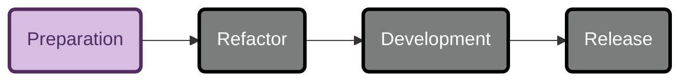
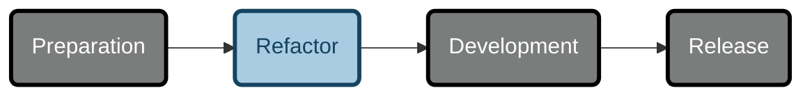
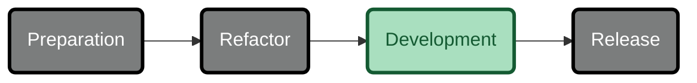
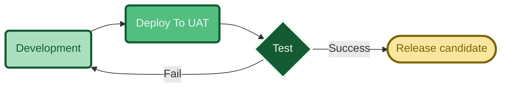
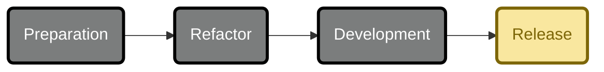

<!-- u250303 -->

> Last updated: March 3, 2025

<div align="center">


 <h1>Development workflows</h1>

</div>

<div align="center">



</div>

Preparing to develop a new release of Tingen requires:

1. Archiving repository branches
2. Updating external components
3. Updating the source code versions/builds
4. Updating the documentation

## Archive repository branches

  Create a `YY.DD.##-development+final` branch for each of the following repositories:

* Tingen-WebService
* Outpost31
* Tingen-Documentation

## Update external components

### AutoHotKey script

Update the following components of the AutoHotkey script:

* ALT+CTRL+SHIFT+P
* ALT+CTRL+SHIFT+R
* ALT+CTRL+SHIFT+V
  
### Sandcastle profiles

Update the Sandcastle "Help file version" in the following Sandcastle profiles:

* Tingen
* Outpost31

## Update the source code

### AssemblyInfo.cs

Update the following `AssemblyInfo.cs` files with the current version number:

* Tingen_development/Properties/AssemblyInfo.cs
* Outpost31/Properties/AssemblyInfo.cs
  
### Class file headers

Update the file headers for the following files:

* Tingen.Tingen.asmx.cs
* Outpost31.WelcomeToOutpost31.cs

### The `tnBuild` value

Update `tnBuild` value in `Core.Session.TingenSession.BuildStaticVars()` to the current `YYMMDD.HHMM` value.

For example:

```csharp
return new Dictionary<string, string>
{
    { "tnBuild",              "241205.0944" },
    { "avSystemCode",         "UAT" },
    { "tnDataRoot",           @"C:\TingenData" },
    { "tnConfigFileName",     "Tingen.config" },
    { "ntstSecurityFileName", "NtstSecurity.config" }
};
```

## Update the documentation

Search for the following string in the documentation...

```markdown

```

...where `YY.MM` is the Year.Month value for the current documentation, and keeping in mind that the "***%20***" in "**%20***MM*" is a space!

Replace the value of `YY.MM` with the current Year.Month.

For example:

```markdown

```

***

<br>

<div align="center">



</div>

During the refactor phase the following components are cleand up and/or refactored:

* Source code
* Source code comments
* XML documentation
* Documentation

***

<br>

<div align="center">



</div>

Development consists of:

* Determining new functionality
* Adding new functionality
* Updating/modifying current functionality
* Testing
* Squishing bugs
* Adding new documentation
* Updating/modifying current documentation

## Daily development



## Release

<div align="center">



### Release candidate

### Stable

### Community


- December 20: Abatab WinterYY
- March 20: Abatab SpringYY
- June 20: Abatab SummerYY
- September 20: Abatab AutumnYY

For example: `Abatab Autumn23`


<!--

Color codes
-----------
Project #b71c1c
Documentation #9c27b0

Outpost31/Tingen #ff9800

Development #42a5f5 
Release candidate #26c6da
Stable release #4caf50 
Community #ffee58

Daily Development
Monthly development

UAT
LIVE

Testing #a1887f

General: #eceff1 
Background#37474f

 #ffc107

-->