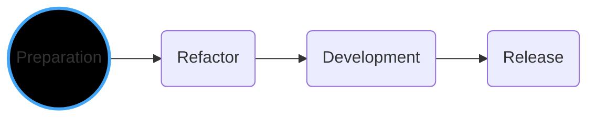
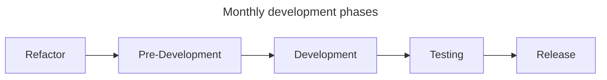
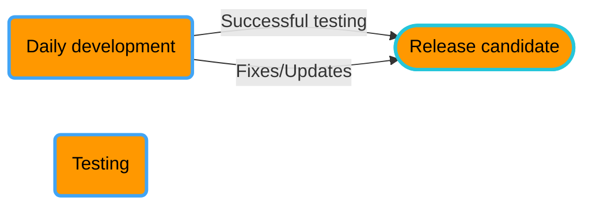

<!-- u250303 -->

> Last updated: March 3, 2025

 <h1>Monthly development</h1>

  style Preparation color:#FFF,stroke:#42a5f5,stroke-width:3px

# Monthly development

## Monthly development timeline

**Refactor**  
Prior to developing a new version of Tingen, the previous version should be cleaned up and refactored.

**Pre-development**  
Features/fixes that will be included in the development version are decided upon.

**Development**  
Development of features/fixes.

**Testing**  
Regression testing.

**Release**  
Development version release.

```mermaid
gantt
  title Tingen phases of development timeline
  dateFormat X
  axisFormat %d
  Refactor : 0, 5d
  Pre-Development : 1d
  Development : 22d
  Testing : 2d
  Release : 1d
```

# Release candidates

# Stable

# Community

- December 20: Abatab WinterYY
- March 20: Abatab SpringYY
- June 20: Abatab SummerYY
- September 20: Abatab AutumnYY

For example: `Abatab Autumn23`

<!--

Color codes
-----------
Project #b71c1c
Documentation #9c27b0

Outpost31/Tingen #ff9800

Development #42a5f5 
Release candidate #26c6da
Stable release #4caf50 
Community #ffee58

Daily Development
Monthly development

UAT
LIVE

Testing #a1887f

General: #eceff1 
Background#37474f

 #ffc107

-->