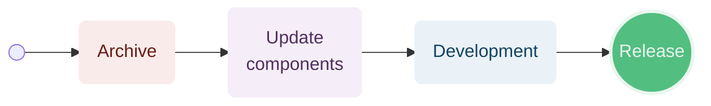
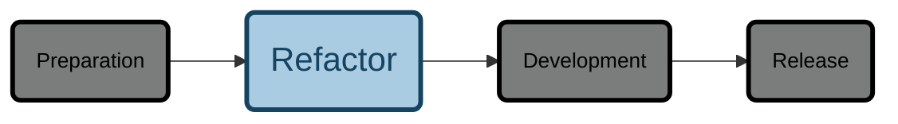
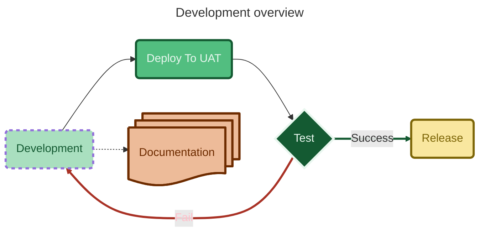
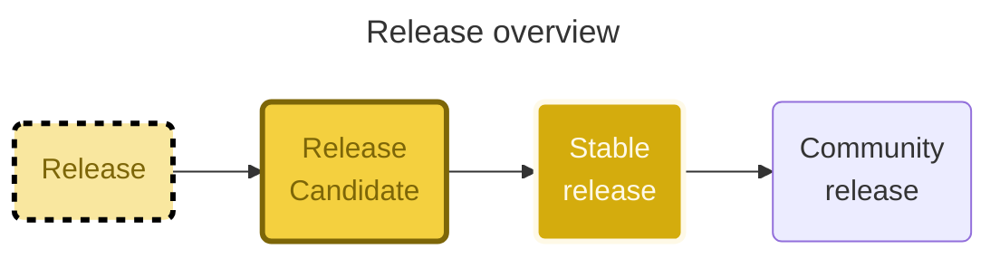

<!-- u250304 -->

> Last updated: March 4, 2025

<div align="center">


  <h1>Workflows</h1>

</div>

<br>

<div align="center">



</div>

<br>

***

<!--
ARCHIVE WORKFLOW
This HTML is ugly, but needs to be this way to work.
-->

<details>
  <summary>

 ```mermaid
  flowchart LR
    %% Components
    Archive@{shape: rounded, label: "Archive"}
    ArchiveRepostitories@{shape: rounded, label: "Archive\nRepositories"}
    %% Layout
    Start:::Hidden -.->Archive:::R5_ --> ArchiveRepostitories:::R1_ -.-> Continue:::Hidden
    %% Styles
    classDef R5_ stroke:#641e16,stroke-width:3px,fill:#f9ebea,color:#641e16,font-size:8pt 
    classDef R1_ stroke:#f9ebea,stroke-width:3px,fill:#E6B0AA,color:#641e16
    %% Styles - Global
    classDef Hidden display: none;
  ```

</summary>

## Archive repositories

Create a `YY.DD.##-development+final` branch for each of the following repositories:

* Tingen-WebService
* Outpost31
* Tingen-Documentation

</details>

<br>

<!--
UPDATE COMPONENTS WORKFLOW
This HTML is ugly, but needs to be this way to work.
-->

<details>
  <summary>

  ```mermaid
  flowchart LR
    %% Components
    UpdateComponents@{shape: rounded, label: "Update\ncomponents"}
    UpdateAutoHotKey@{shape: rounded, label: "Update\nAutoHotKey script"}
    UpdateSandCastleProfiles@{shape: rounded, label: "Update\nSandcastle profiles"}
    UpdateSourceCode@{shape: rounded, label: "Update\nsource code"}
    UpdateDocumentation@{shape: rounded, label: "Update\ndocumentation"}
    %% Layout
    UpdateComponents:::P5_ --> UpdateAutoHotKey:::P6_ --> UpdateSandCastleProfiles:::P6_ -->  UpdateSourceCode:::P6_ --> UpdateDocumentation:::P6_
    %% Styles
    classDef R5_ stroke:#641e16,stroke-width:3px,stroke-dasharray: 5 5,fill:#f9ebea,color:#641e16,font-size:8pt
    classDef P5_ stroke:#512e5f,stroke-width:3px,fill:#f5eef8,color:#512e5f
    classDef P6_ stroke:#512e5f,stroke-width:3px,fill:#d7bde2,color:#512e5f
    %% Styles - Global
    classDef Hidden display: none;
  ```

  </summary>

### Update the AutoHotKey script

Update the following components of the AutoHotkey script:

* ALT+CTRL+SHIFT+P
* ALT+CTRL+SHIFT+R
* ALT+CTRL+SHIFT+V
  
### Update Sandcastle profiles

Update the Sandcastle "Help file version" in the following Sandcastle profiles:

* Tingen
* Outpost31

## Update the source code

### AssemblyInfo.cs

Update the following `AssemblyInfo.cs` files with the current version number:

* Tingen_development/Properties/AssemblyInfo.cs
* Outpost31/Properties/AssemblyInfo.cs
  
### Class file headers

Update the file headers for the following files:

* Tingen.Tingen.asmx.cs
* Outpost31.WelcomeToOutpost31.cs

### The `tnBuild` value

Update `tnBuild` value in `Core.Session.TingenSession.BuildStaticVars()` to the current `YYMMDD.HHMM` value.

For example:

```csharp
return new Dictionary<string, string>
{
    { "tnBuild",              "241205.0944" },
    { "avSystemCode",         "UAT" },
    { "tnDataRoot",           @"C:\TingenData" },
    { "tnConfigFileName",     "Tingen.config" },
    { "ntstSecurityFileName", "NtstSecurity.config" }
};
```

## Update the documentation

Search for the following string in the documentation...

```markdown

```

...where `YY.MM` is the Year.Month value for the current documentation, and keeping in mind that the "***%20***" in "**%20***MM*" is a space!

Replace the value of `YY.MM` with the current Year.Month.

For example:

```markdown

```

</details> <!-- PREPARATION WORKFLOW -->

<!--
REFACTOR WORKFLOW
This HTML is ugly, but needs to be this way to work.
-->

<details>
<summary> Refactor workflow



</summary>

During the refactor phase the following components are cleand up and/or refactored:

* Source code
* Source code comments
* XML documentation
* Documentation

</details> <!-- REFACTOR WORKFLOW -->

<!--
DEVELOPMENT WORKFLOW
This HTML is ugly, but needs to be this way to work.
-->

<details>
<summary> Development workflow


</summary>

Development consists of:

* Determining new functionality
* Adding new functionality
* Updating/modifying current functionality
* Testing
* Squishing bugs
* Adding new documentation
* Updating/modifying current documentation

<div align="center">



</div>

</details> <!-- DEVELOPMENT WORKFLOW -->

<details>
  <summary>Release workflow


  
</summary>


</details> <!-- RELEASE WORKFLOW -->

***


<div align="center">



</div>


### Release candidate

### Stable

### Community


- December 20: Abatab WinterYY
- March 20: Abatab SpringYY
- June 20: Abatab SummerYY
- September 20: Abatab AutumnYY

For example: `Abatab Autumn23`


<!--

Color codes
-----------
Project #b71c1c
Documentation #9c27b0

Outpost31/Tingen #ff9800

Development #42a5f5 
Release candidate #26c6da
Stable release #4caf50 
Community #ffee58

Daily Development
Monthly development

UAT
LIVE

Testing #a1887f

General: #eceff1 
Background#37474f

 #ffc107

-->