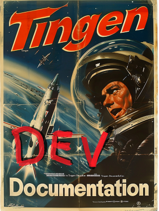
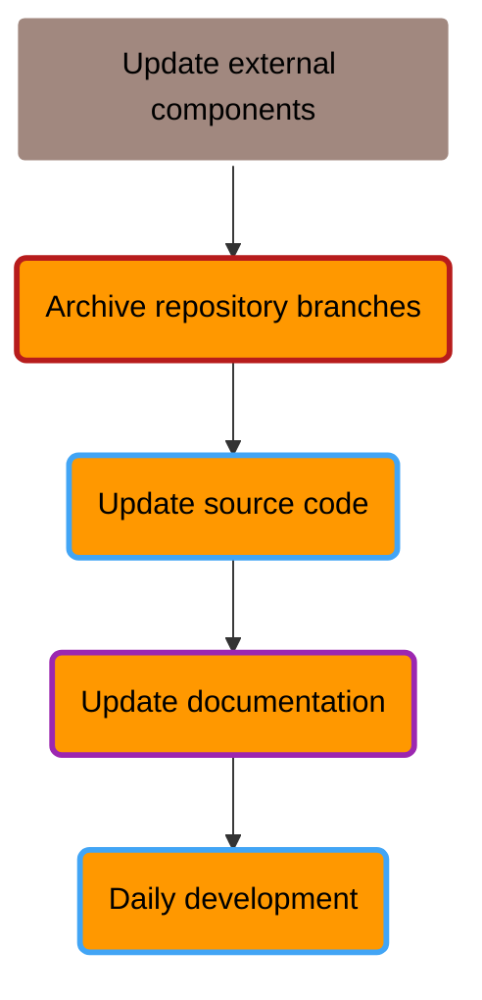
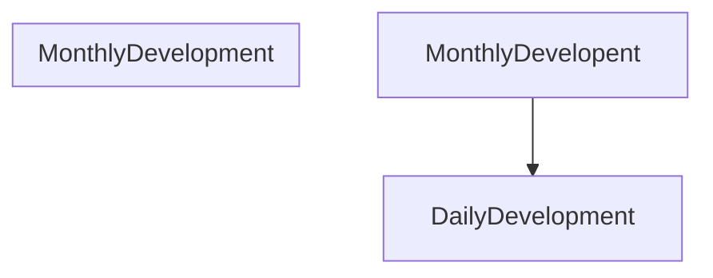
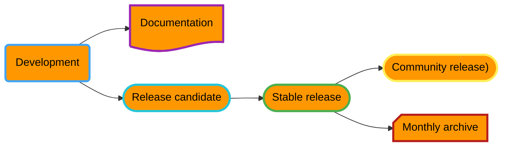
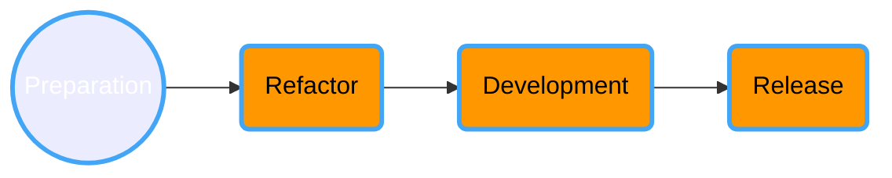
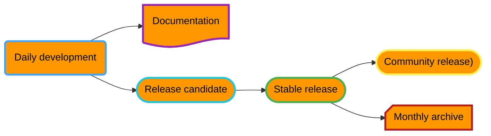

<!-- u250114 -->

> Last updated: January 14, 2025

<div align="center">



 <h1>Development workflow</h1>

</div>

# Overview

```mermaid
gantt
  title Monthly development phases
  dateFormat X
  axisFormat %d
  Planning : 0, 2d
  Refactor : 4d
  Development : 24d
  Release : 1d
```



## Planning

During the planning phase:

* The current development branch is archived
* Source code and documentation version numbers are updated
* External components are updated
* Upcoming features are ironed out

### Archiving the current development branch

TBD

### Preparing for a new monthly release



## Preparation

### 1. Update external components

#### 1a. AutoHotKey

Update the following components of the AutoHotkey script:

* ALT+CTRL+SHIFT+P
* ALT+CTRL+SHIFT+R
* ALT+CTRL+SHIFT+V
  
#### 1b. Sandcastle

Update the Sandcastle "Help file version" in the following Sandcastle profiles:

* Tingen
* Outpost31
  
### 2. Archive repository branches

  Create a `YY.DD.##-development+final` branch for each of the following repositories:

* Tingen_development
* Outpost31
* Tingen-Documentation

### 3. Update the source code

#### 3a. AssemblyInfo.cs

Update the following `AssemblyInfo.cs` files with the current version number:

* Tingen_development/Properties/AssemblyInfo.cs
* Outpost31/Properties/AssemblyInfo.cs
  
#### 3b. File headers

Update the file headers for the following files:

* Tingen.Tingen.asmx.cs
* Outpost31.WelcomeToOutpost31.cs

#### 3c. `tnBuild` value

Update `tnBuild` value in `Core.Session.TingenSession.BuildStaticVars()` to the current `YYMMDD.HHMM` value.

For example:

```csharp
return new Dictionary<string, string>
{
    { "tnBuild",              "241205.0944" },
    { "avSystemCode",         "UAT" },
    { "tnDataRoot",           @"C:\TingenData" },
    { "tnConfigFileName",     "Tingen.config" },
    { "ntstSecurityFileName", "NtstSecurity.config" }
};
```

### 4. Update the documentation

Search for the following string in the documentation...

```markdown

```

...where `YY.MM` is the Year.Month value for the current documentation, and keeping in mind that the "***%20***" in "**%20***MM*" is a space!

Replace the value of `YY.MM` with the current Year.Month.

For example:

```markdown

```


## Refactor

During the refactor phase:

* The codebase is cleaned up
* Documentation is cleaned up

## Development

During the development phase:

* New functionality is added
* Existing functionality is updated/modified
* Bugs are squished
* New documentation is added
* Existing documentation is updated/modified
* Iterative testing is done in a non-production environment

## Release

During the release phase:

* TBD


## Monthly development








***








During monthly development and testing:

* The current development branches are archived
* 
* The existing codebase is refactored and cleaned up
* New functionality is added, and existing functionality is updated/modified
* Bugs are squished
* Code is refactored
* New documentation is added, and existing documentation is updated/modified
* Iterative testing is done in a non-production environment
