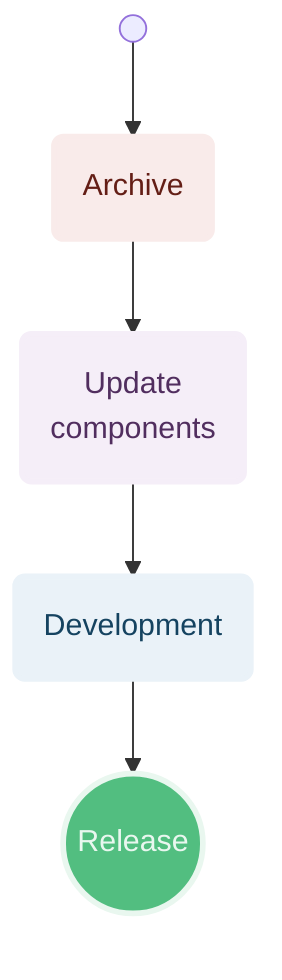
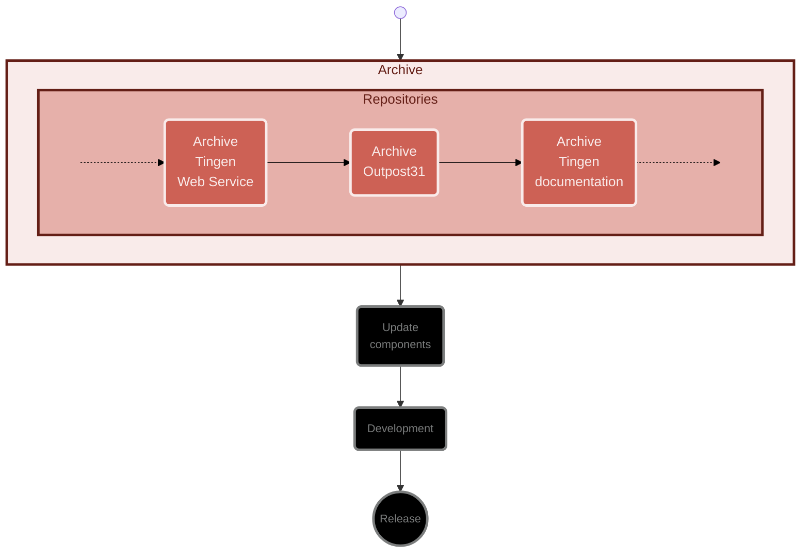
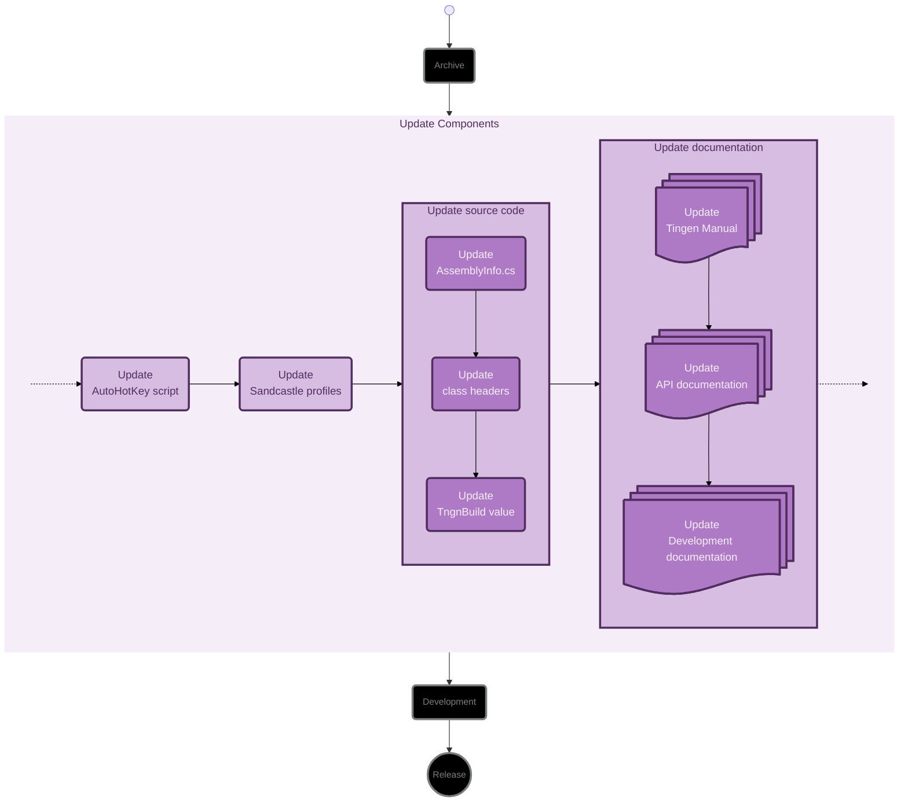
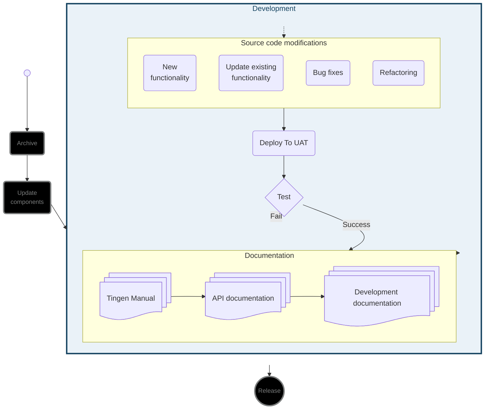
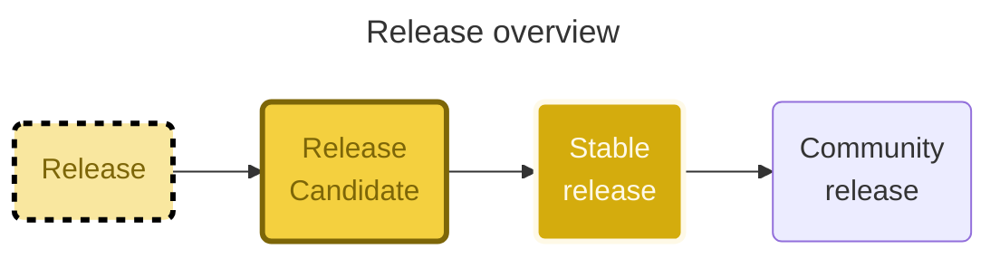

<!-- u250304 -->

> Last updated: March 4, 2025

<div align="center">


  <h1>Workflows</h1>

</div>

<br>

<div align="center">



</div>

<br>
<br>

<!--
ARCHIVE WORKFLOW
This HTML is ugly, but needs to be this way to work.
-->

# ARCHIVE



## Archive repositories

Create a `YY.DD.##-development+final` branch for each of the following repositories:

* Tingen-WebService
* Outpost31
* Tingen-Documentation

<br>

***

<br>

<!--
UPDATE COMPONENTS WORKFLOW
This HTML is ugly, but needs to be this way to work.
-->

# UPDATE COMPONENTS



## Update the AutoHotKey script

Update the following components of the AutoHotkey script:

* ALT+CTRL+SHIFT+P
* ALT+CTRL+SHIFT+R
* ALT+CTRL+SHIFT+V
  
## Update Sandcastle profiles

Update the Sandcastle "Help file version" in the following Sandcastle profiles:

* Tingen
* Outpost31

## Update the source code

### AssemblyInfo.cs

Update the following `AssemblyInfo.cs` files with the current version number:

* Tingen_development/Properties/AssemblyInfo.cs
* Outpost31/Properties/AssemblyInfo.cs
  
### Class file headers

Update the file headers for the following files:

* Tingen.Tingen.asmx.cs
* Outpost31.WelcomeToOutpost31.cs

### The `tnBuild` value

Update `tnBuild` value in `Core.Session.TingenSession.BuildStaticVars()` to the current `YYMMDD.HHMM` value.

For example:

```csharp
return new Dictionary<string, string>
{
    { "tnBuild",              "241205.0944" },
    { "avSystemCode",         "UAT" },
    { "tnDataRoot",           @"C:\TingenData" },
    { "tnConfigFileName",     "Tingen.config" },
    { "ntstSecurityFileName", "NtstSecurity.config" }
};
```

## Update the documentation

Search for the following string in the documentation...

```markdown

```

...where `YY.MM` is the Year.Month value for the current documentation, and keeping in mind that the "***%20***" in "**%20***MM*" is a space!

Replace the value of `YY.MM` with the current Year.Month.

For example:

```markdown

```

<br>

***

<br>

<!--
DEVELOPMENT WORKFLOW
This HTML is ugly, but needs to be this way to work.
-->




```mermaid
flowchart LR
  %% Components
  Development@{shape: rounded, label: "Development"}
  DeployToUat@{shape: rounded, label: "Deploy To UAT"}
  %% Document@{shape: docs, label: "Documentation"}
  Test@{shape: diamond, label: "Test"}
  %% Release@{shape: rounded, label: "Release"}
  %% Layout
  Start:::Hidden -.-> Development:::U5a_ -.-> DeployToUat:::U6_
  DeployToUat --> Test

  %% Styles
  classDef U5a_ stroke:#154360,stroke-width:3px,fill:#eaf2f8,color:#154360
  classDef U6_ stroke:#154360,stroke-width:3px,fill:#a9cce3,color:#154360
  linkStyle 3 stroke:#A93226,stroke-width:3px, color: pink;
  linkStyle 4 stroke:#145a32,stroke-width:3px
  %% Styles - Global
  classDef Hidden display: none;
```

During the refactor phase the following components are cleand up and/or refactored:

* Source code
* Source code comments
* XML documentation
* Documentation
Development consists of:

* Determining new functionality
* Adding new functionality
* Updating/modifying current functionality
* Testing
* Squishing bugs
* Adding new documentation
* Updating/modifying current documentation

<div align="center">


</div>

</details> <!-- DEVELOPMENT WORKFLOW -->

<details>
  <summary>Release workflow


  
</summary>


</details> <!-- RELEASE WORKFLOW -->

***


<div align="center">



</div>


### Release candidate

### Stable

### Community


- December 20: Abatab WinterYY
- March 20: Abatab SpringYY
- June 20: Abatab SummerYY
- September 20: Abatab AutumnYY

For example: `Abatab Autumn23`


<!--

-->

```mermaid
flowchart LR
  classDef R0_ stroke:#f9ebea,stroke-width:3px,fill:#f9ebea,color:#641e16
  classDef R1_ stroke:#f9ebea,stroke-width:3px,fill:#E6B0AA,color:#641e16
  classDef R2_ stroke:#f9ebea,stroke-width:3px,fill:#CD6155,color:#f9ebea
  classDef R3_ stroke:#f9ebea,stroke-width:3px,fill:#A93226,color:#f9ebea
  classDef R4_ stroke:#f9ebea,stroke-width:3px,fill:#641e16,color:#f9ebea
  classDef R5_ stroke:#641e16,stroke-width:3px,fill:#f9ebea,color:#641e16
  classDef R6_ stroke:#641e16,stroke-width:3px,fill:#E6B0AA,color:#641e16
  classDef R7_ stroke:#641e16,stroke-width:3px,fill:#CD6155,color:#f9ebea
  classDef R8_ stroke:#641e16,stroke-width:3px,fill:#A93226,color:#f9ebea
  classDef R9_ stroke:#641e16,stroke-width:3px,fill:#641e16,color:#f9ebea
```


<!--

Color codes
-----------
Project #b71c1c
Documentation #9c27b0

Outpost31/Tingen #ff9800

Development #42a5f5 
Release candidate #26c6da
Stable release #4caf50 
Community #ffee58

Daily Development
Monthly development

UAT
LIVE

Testing #a1887f

General: #eceff1 
Background#37474f

 #ffc107

-->