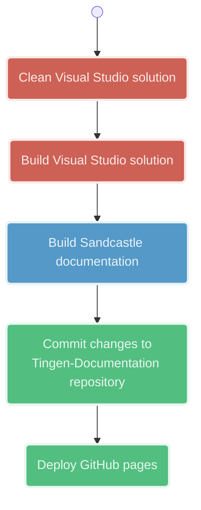

<!-- u250421 -->

<!--
  I'm sure the Mermaid.js code here looks awful, but it was a real pain to get
  all it looking the way it does, so I don't plan on touching it going forward.

  The rest of the document will be updated normally.
-->

> Last updated: May 21, 2025

  <h1>Documentation workflows</h1>

 

## Sandcastle/GitHub pages

 
