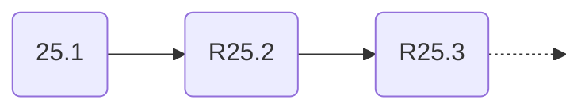
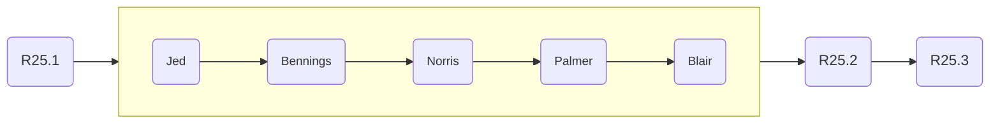
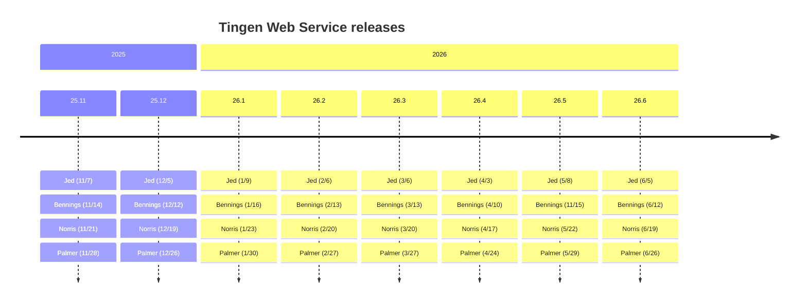
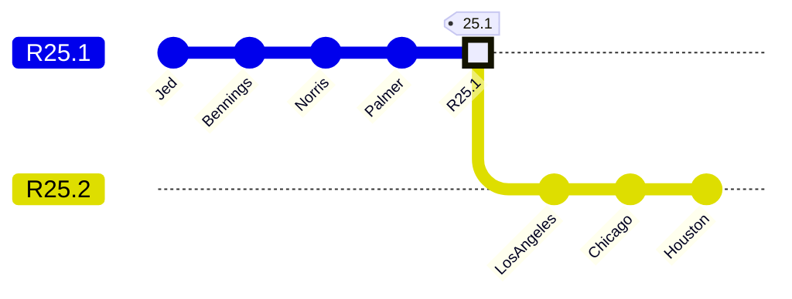

<!-- u251118 -->

[[🏠︎](../README.md)]

  <picture>
    <source media="(prefers-color-scheme: dark)" srcset="https://github.com/spectrum-health-systems/tingen-projects/blob/main/logos/tngndocs-dark-400x63.png">
    <source media="(prefers-color-scheme: light)" srcset="https://github.com/spectrum-health-systems/tingen-projects/blob/main/logos/tngndocs-light-400x63.png">
    
  </picture>
  <h1>
    Development cycle
  </h1>

# Overview

flowchart LR
    %% Components
    A@{shape: rounded, label: "-.->"}
    B@{shape: rounded, label: "--->"}
    C@{shape: rounded, label: "===>"}
    HiddenA@{shape: rounded}
    E@{shape: rounded, label: "--o>"}
    F@{shape: rounded, label: "==o"}
    HiddenB@{shape: rounded}
    H@{shape: rounded, label: "--x>"}
    I@{shape: rounded, label: "==x>"}
    HiddenC@{shape: rounded}
    J@{shape: rounded, label: ["~ ~ ~"]}
    K@{shape: rounded, label: "Invisible!"}
    L@{shape: rounded, label: "Red line"}
    M@{shape: rounded, label: "Blue line, red text"}
    N@{shape: rounded, label: " "}
    HiddenD@{shape: rounded}
    %% Layout
    A -.-> B --> C ==> HiddenA
    E --o F ==o HiddenB
    H --x I ==x HiddenC
    J ~~~ K
    L --> M -- Text --> N
    %% Styles
    classDef Hidden display: none;
    class HiddenA,HiddenB,HiddenC,HiddenD Hidden
    linkStyle 8 stroke:#e74c3c,stroke-width:4px,color:red;
    linkStyle 9 stroke:#3498db ,stroke-width:4px,color:red;

```mermaid
flowchart LR
    %% Components
    January@{shape: rounded, label: "RYY.1"}
    February@{shape: rounded, label: "RYY.2"}
    March@{shape: rounded, label: "RYY.3"}
    April@{shape: rounded, label: "RYY.4"}
    May@{shape: rounded, label: "RYY.5"}
    June@{shape: rounded, label: "RYY.6"}
    July@{shape: rounded, label: "RYY.7"}
    August@{shape: rounded, label: "RYY.8"}
    September@{shape: rounded, label: "RYY.9"}
    October@{shape: rounded, label: "RYY.10"}
    November@{shape: rounded, label: "RYY.11"}
    December@{shape: rounded, label: "RYY.12"}
    %% Layout
    January:::aa_ --> February --> March --> April --> May --> June --> July --> August --> September --> October --> November --> December
    %% Styles
    classDef aa_ font-size:10pt
    classDef Y8_ stroke:#7d6608,stroke-width:3px,fill:#d4ac0d,color:#fef9e7
    classDef U3_ stroke:#eaf2f8,stroke-width:3px,fill:#2471a3,color:#eaf2f8
    classDef P3_ stroke:#f5eef8,stroke-width:3px,fill:#884ea0,color:#f5eef8
    classDef G3_ stroke:#e9f7ef,stroke-width:3px,fill:#1d8348,color:#e9f7ef
    classDef B8_ stroke:#626567,stroke-width:3px,fill:#000000,color:#626567
```

# Weekly

***

[[🏠︎](../README.md)]

Jed
Bennings
Norris
Palmer
Blair
