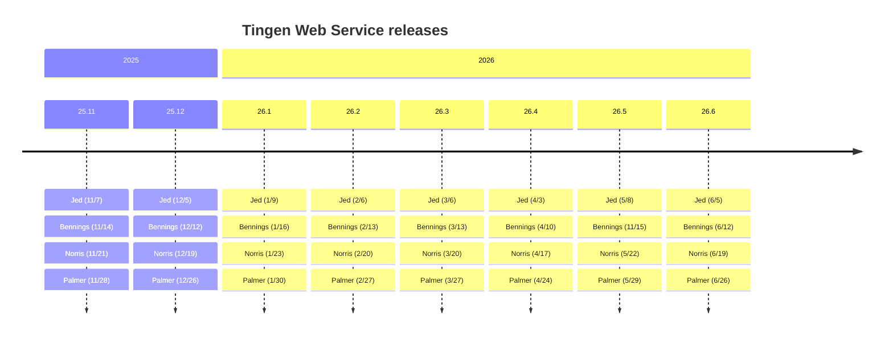
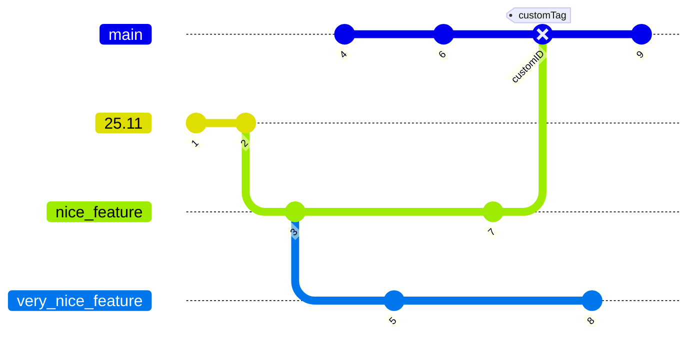

<!-- u251118 -->

[[🏠︎](../README.md)]

  <picture>
    <source media="(prefers-color-scheme: dark)" srcset="https://github.com/spectrum-health-systems/tingen-projects/blob/main/logos/tngndocs-dark-400x63.png">
    <source media="(prefers-color-scheme: light)" srcset="https://github.com/spectrum-health-systems/tingen-projects/blob/main/logos/tngndocs-light-400x63.png">
    
  </picture>
  <h1>
    Development timeline
  </h1>

***

[[🏠︎](../README.md)]

Jed
Bennings
Norris
Palmer
Blair
