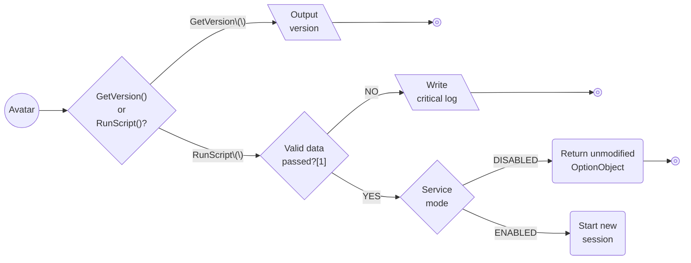

<!-- u250905 -->

# Tingen Web Service/Outpost31 process flow

## Initializing the Tingen Web Service

> NOTES:  
> [1] The Tingen Web Service requires that both a valid `OptionObject` and `Script Parameter` are passed.

 

****

## Starting a new session

```mermaid
flowchart LR
  %% Content
  From_TingenWebService.asmx.cs@{ shape: rounded, label: "TingenWebService.asmx.cs" }
  CreateSessionFolder@{ shape: rounded, label: "Create session folder" }
  subgraph Outpost31.Core.Session.Instance.Start ["Outpost31.Core.Session.Instance.Start[1]"]
    direction LR
      %% Content
      SetCurrentStamp@{ shape: rect, label: "Set current\ndate/time" }
      SetAvatarInfo@{ shape: rect, label: "Set Avatar System\nand User ID" }
      SetServiceInfo@{ shape: rect, label: "Set service version,\nmode, and framework" }
      SetLoggingInfo@{ shape: rect, label: "Set log\nsettings" }    
      SetOptionObjects@{ shape: rect, label: "Set\nOptionObjects" }
      SetScriptParameter@{ shape: rect, label: "Set Script\nParameter details" }
      %% Layout
      SetCurrentStamp --> SetAvatarInfo --> SetServiceInfo --> SetLoggingInfo --> SetOptionObjects --> SetScriptParameter
      %% Styles
  end
  %% Layout
  From_TingenWebService.asmx.cs --> Outpost31.Core.Session.Instance.Start --> CreateSessionFolder
  %% Styles 
```

> NOTES:  
> [1] Some of these use existing Web.config settings, some are set when the session starts.