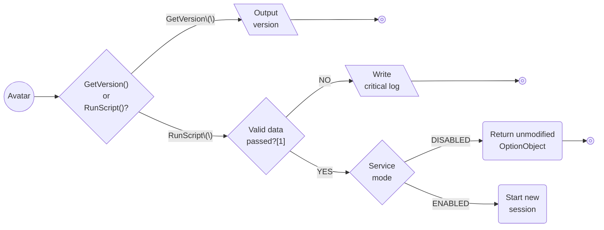
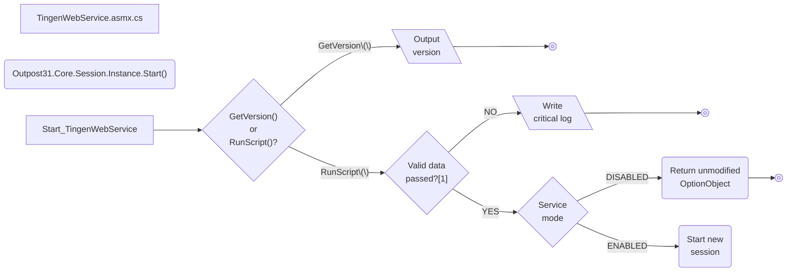
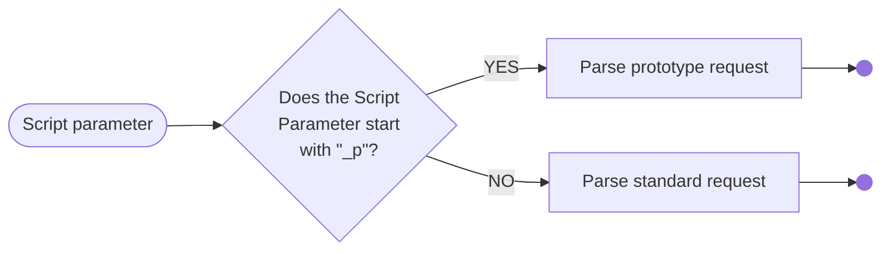
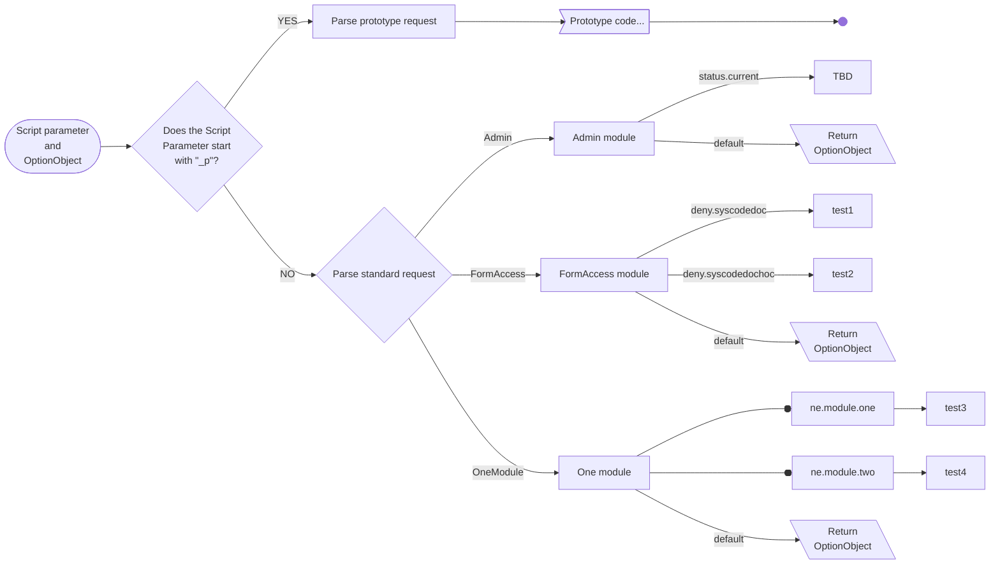

<!-- u250905 -->

# Tingen Web Service/Outpost31 process flow

## Initializing the Tingen Web Service

[1] The Tingen Web Service requires that both a valid `OptionObject` and `Script Parameter` are passed.

 

****

## Starting a new session

mermaid 
<!--

-->

# Determine the type of request

# Standard requests

## The Admin Module

    subgraph Initialize ["New Session"]
      direction TB

      RuntimeConfig.New@{ shape: fr-rect, label: "Create new\n**RuntimeConfig**\ninstance" } -->
      CoreConfig.New@{ shape: fr-rect, label: "Create new\n**CoreConfig**\ninstance" } -->
      ModuleConfig.New@{ shape: fr-rect, label: "Create new\n**ModuleConfig**\ninstance" } -->
      AvtrOptionObject.New@{ shape: fr-rect, label: "Create new\n**AvtrOptionObject**\ninstance" } -->
      AvtrParameter.New@{ shape: fr-rect, label: "Create new\n**AvtrParameter**\ninstance" } -->
      AvtrSystemInfo.New@{ shape: fr-rect, label: "Create new\n**AvtrSystemInfo**\ninstance" }
    end

    AvtrSystemInfo.New --> Parse_ScriptParameter@{ shape: rounded, label: "Parse script parameter" }