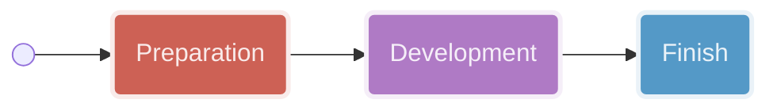
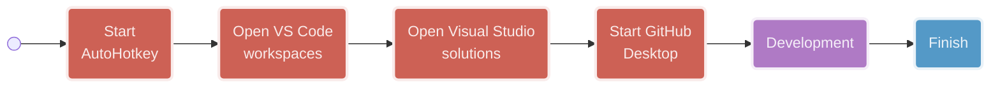
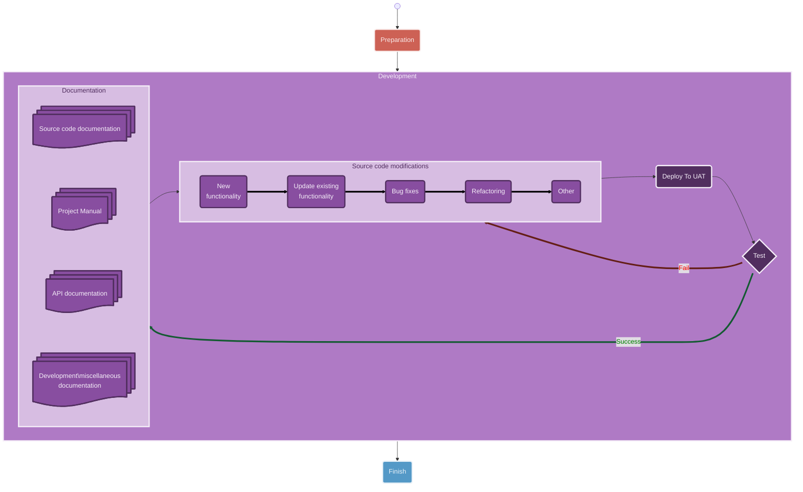
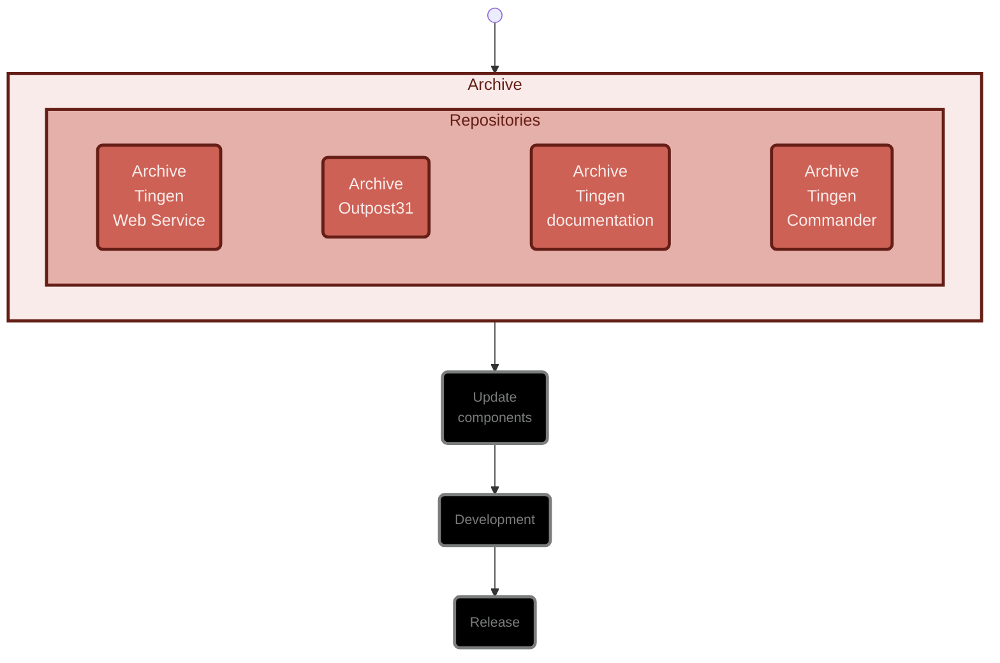
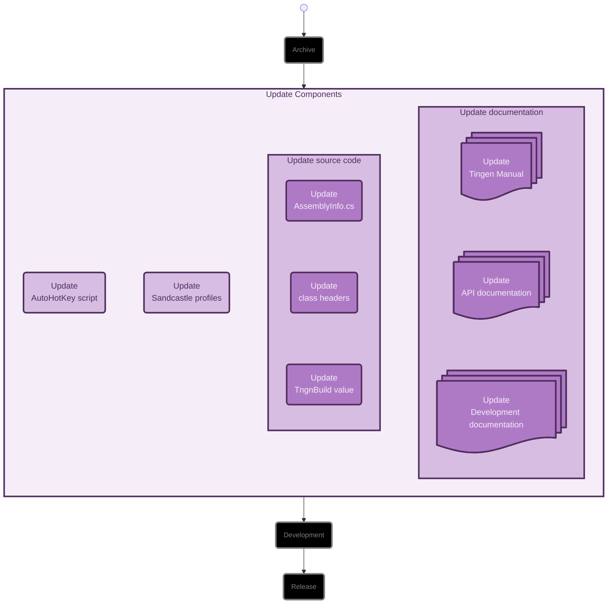
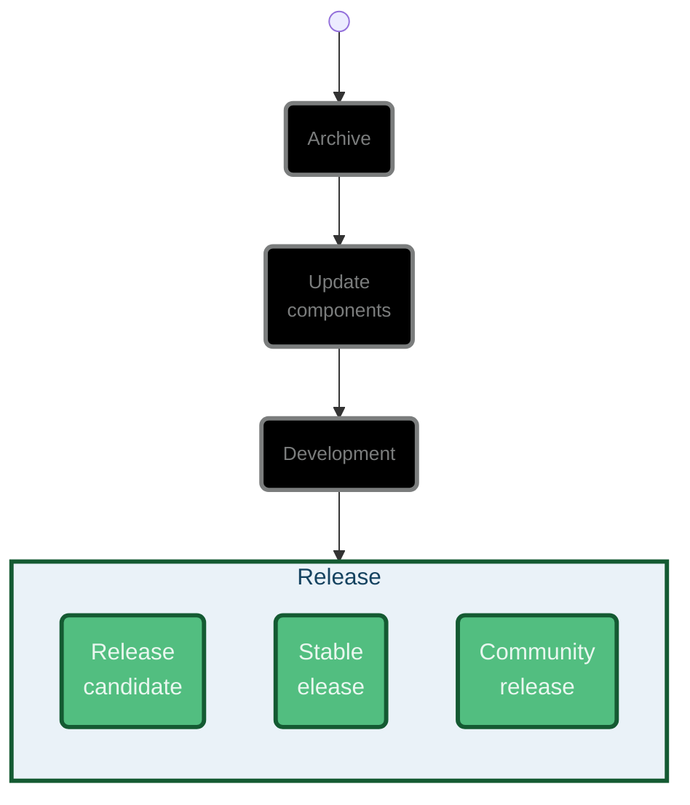
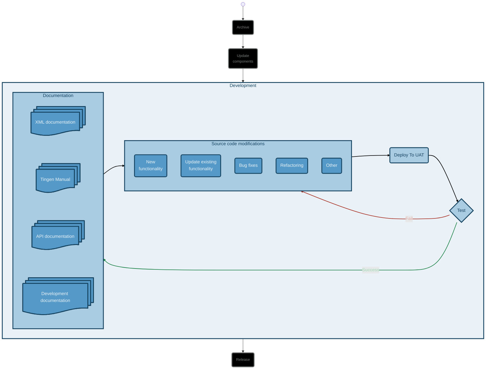

<!-- u250701 -->

<!--
  I'm sure the Mermaid.js code here looks awful, but it was a real pain to get
  all it looking the way it does, so I don't plan on touching it going forward.

  The rest of the document will be updated normally.
-->

# Daily workflow

This is the daily workflow for all Tingen projects.

<div align="center">



</div>

## Preparation

<div align="center">



</div>

## Development

<div align="center">



</div>

# Monthly workflow

<div align="center">



</div>

## Archive repositories

### Development branches

Use the *development* branch of the following repositories to create a `YY.DD.##-development+final` branch:

* Tingen-WebService
* Outpost31

### Main branches

Use the *main* branch of the following repositories to create a `YY.DD.##-development+final` branch:

* Tingen-Documentation

<br>

***

<br>

<!-- UPDATE COMPONENTS -->

## UPDATE COMPONENTS

<div align="center">



</div>

### Update the AutoHotKey script

Update the following components of the AutoHotkey script:

* ALT+CTRL+SHIFT+Y
  
### Update Sandcastle profiles

Update the Sandcastle "Help file version" in the following Sandcastle profiles:

* Tingen-WebService
* Outpost31
* Tingen-Commander

### Update the source code

#### AssemblyInfo.cs

Update the following `AssemblyInfo.cs` files with the current version number:

* Tingen-WebService/Properties/AssemblyInfo.cs
* Outpost31/Properties/AssemblyInfo.cs
* Tingen-Commander/Properties/AssemblyInfo.cs
  
#### Class file headers

Update the file headers for the following files:

* TingenWebService.ProjectInfo.cs
* Outpost31.ProjectInfo.cs
* TingenCommander.MainWindow.xaml.cs

#### The `tnBuild` value

Update `tnBuild` value in `Core.ConfigRuntime.New()` to the current `YYMMDD` value.

For example:

```text
.
.
TngnWbsvBuild = "250430",
.
.
```

### Update the documentation

Search for the following string in the documentation...

```markdown

```

...where `VERSION` is the version/release for the current documentation.

Replace the value of `VERSION` with the current version/release.

<br>

***

<br>


## New functionality

## Updating existing functionality

## Bug fixes

## Refactoring

## Other

## Deploying to UAT

## Testing

## Updating XML documentation

## Updating the Tingen Manual

## Updating the API documentation

## Updating the Development documentation

<!-- RELEASE -->

# RELEASE

<div align="center">



</div>

## Release candidate

## Stable

## Community

* December 20: Abatab WinterYY
* March 20: Abatab SpringYY
* June 20: Abatab SummerYY
* September 20: Abatab AutumnYY

For example: `Abatab Autumn23`


<!-- unused

<div align="center">



</div>

-->