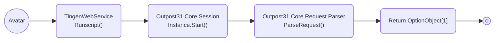
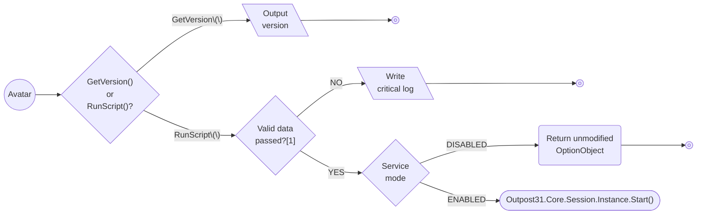
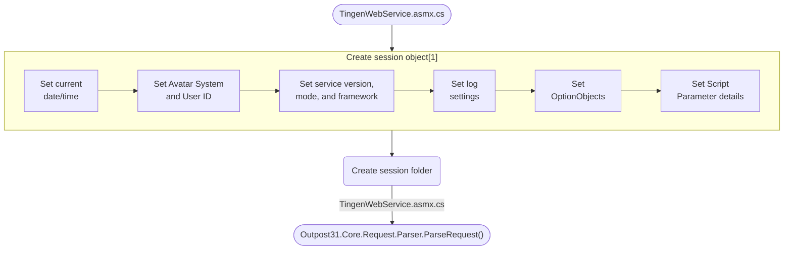
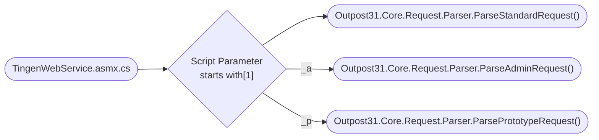

<!-- u250905 -->

# Tingen Web Service/Outpost31 Main Process Workflows

> NOTES:  
> [1] The returned OptionObject *may or may not be* modified.

 

***

## TingenWebService Runscript()

> NOTES:  
> [1] The Tingen Web Service requires that both a valid `OptionObject` and `Script Parameter` are passed.

 

****

## Outpost31.Core.Session.Instance.Start()

> NOTES:  
> [1] Some of these use existing Web.config settings, some are set when the session starts.

 

****

## Outpost31.Core.Request.Parser.ParseRequest()

> NOTES:  
> [1] There are three types of requests:
> * Standard requests do not have a prefix  
> * Administrative requests start with **"_a"**
> * Prototype requests start with **"_p"**
