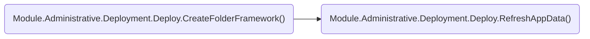

<!-- u250908 -->

# Module.Administrative

## Module.Administrative.Deployment

### Module.Administrative.Deployment.Deploy()

### Module.Administrative.Deployment.CreateFolderFramework()

### Module.Administrative.Deployment.RefreshAppData()

## Module.Administrative.Development

## Module.Administrative.Testing

## Next

Module.Administrative.Deployment.Deploy()
Module.Administrative.Deployment.Refresh()
Module.Administrative.Testing.Regression()

 
 
 
 
 
  
 
  
 
  
 
  
 
  
 
  
 
  
 
  
 
  
 
  
 
 

# Mo

kjhgkuh