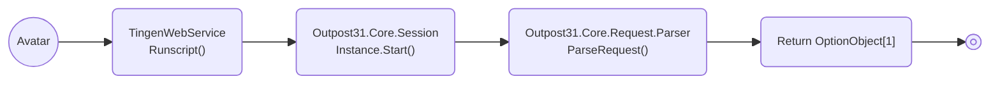

<!-- u250908 -->

# Tingen Web Service Workflow

```mermaid
flowchart LR
  %% Content
  Start@{ shape: circ, label: "Avatar" }
  TingenWebService.Runscript@{ shape: rounded, label: "TingenWebService\nRunscript()" }
  Outpost31.Core.Session.Instance.Start@{ shape: rounded, label: "Outpost31.Core.Session\nInstance.Start()" }
  Outpost31.Core.Request.Parser.ParseRequest@{ shape: rounded, label: "Outpost31.Core.Request.Parser\nParseRequest()" }
  ReturnOptionObject@{ shape: rounded, label: "Return OptionObject[1]" }
  Stop@{ shape: fr-circ}
  %% Layout
  Start:::FP8 --> TingenWebService.Runscript:::FP8 --> Outpost31.Core.Session.Instance.Start:::FP8 -->  Outpost31.Core.Request.Parser.ParseRequest:::FP8 --> ReturnOptionObject:::FP8 -->Stop
  %% Styles
  classDef FP8 font-size:8pt
```

> NOTES:  
> [1] The returned OptionObject *may or may not be* modified.