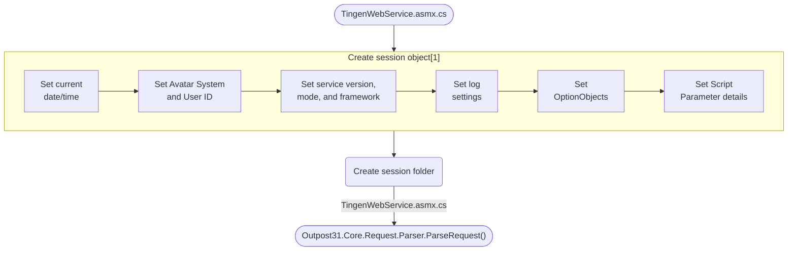

<!-- u250908 -->

# Outpost31.Core.Session.Instance.Start()

> NOTES:  
> [1] Some of these use existing Web.config settings, some are set when the session starts.

## Next

[Outpost31.Core.Request.Parser.ParseRequest()](tngnopto-parser-parserequest.md)