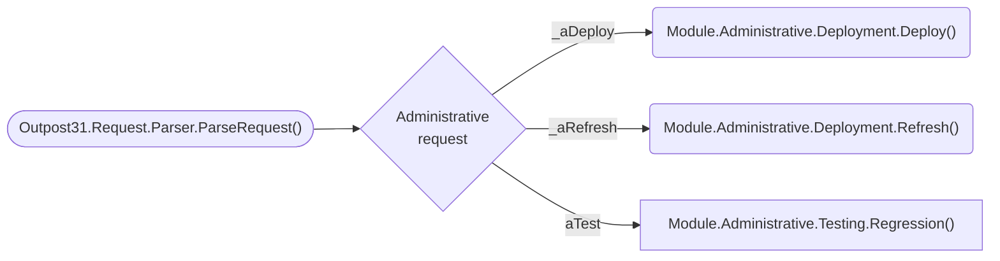

<!-- u250908 -->

# Outpost31.Core.Request.Administrative()

```mermaid
flowchart LR
  %% Content
  From_Outpost31.Request.Parser.ParseRequest@{ shape: stadium, label: "Outpost31.Request.Parser.ParseRequest()" }
  AdministrativeRequest@{ shape: diam, label: "Administrative\nrequest" }
  RequestDeploy@{ shape: rounded, label: "Module.Administrative.Deployment.Deploy()" }
  RequestRefresh@{ shape: rounded, label: "Module.Administrative.Deployment.Refresh()" }
  RequestRegressionTest@{ rounded: stadium, label: "Module.Administrative.Testing.Regression()" }
  %% Layout
  From_Outpost31.Request.Parser.ParseRequest --> AdministrativeRequest
  AdministrativeRequest --_aDeploy--> RequestDeploy
  AdministrativeRequest --_aRefresh--> RequestRefresh
  AdministrativeRequest --aTest--> RequestRegressionTest
```

## Next

