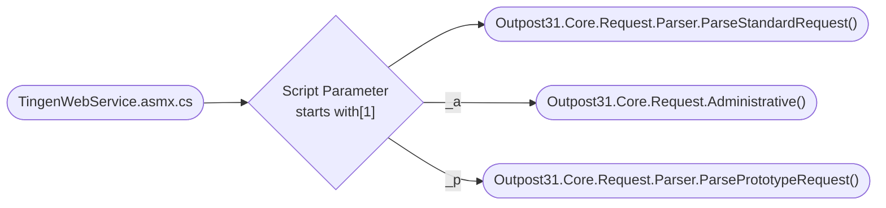

<!-- u250908 -->

# Outpost31.Core.Request.Parser.ParseRequest()

> NOTES:  
> [1] There are three types of requests:
> * Standard requests do not have a prefix  
> * Administrative requests start with **"_a"**
> * Prototype requests start with **"_p"**
