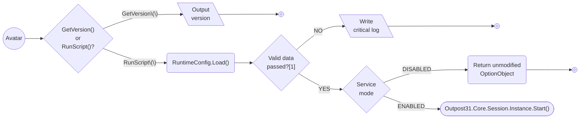

<!-- u250905 -->

# Tingen Web Service Process Workflow

```mermaid
flowchart LR
  %% Content
  Start_TingenWebService@{ shape: circle, label: "Avatar" }
  GetVersionOrRunScript@{ shape: diam, label: "GetVersion()\nor\nRunScript()?" }
  LoadRuntimeConfig@{ shape: rounded, label: "RuntimeConfig.Load()" }
  OutputVersion@{ shape: lean-l, label: "Output\nversion" }
  Stop_GetVersion@{ shape: fr-circ }
  ValidDataPassed@{ shape: diam, label: "Valid data\npassed?[1]" }
  CriticalNoValidData@{ shape: lean-l, label: "Write\ncritical log" }
  Stop_ValidDataNotPassed@{ shape: fr-circ }
  ServiceMode@{ shape: diam, label: "Service\nmode" }
  ReturnUnmodified@{ shape: rounded, label: "Return unmodified\nOptionObject" }
  To_Outpost31.Core.Session.Instance.Start@{ shape: stadium, label: "Outpost31.Core.Session.Instance.Start()" }
  Stop_Disabled@{ shape: fr-circ }
  %% Layout
  Start_TingenWebService --> GetVersionOrRunScript
  GetVersionOrRunScript --GetVersion\(\)--> OutputVersion --> Stop_GetVersion
  GetVersionOrRunScript --RunScript\(\)--> LoadRuntimeConfig
  LoadRuntimeConfig --> ValidDataPassed
  ValidDataPassed --NO--> CriticalNoValidData --> Stop_ValidDataNotPassed
  ValidDataPassed --YES--> ServiceMode
  ServiceMode --ENABLED--> To_Outpost31.Core.Session.Instance.Start
  ServiceMode --DISABLED--> ReturnUnmodified --> Stop_Disabled
  %% Styles
```

> NOTES:  
> [1] The Tingen Web Service requires that both a valid `OptionObject` and `Script Parameter` are passed.
