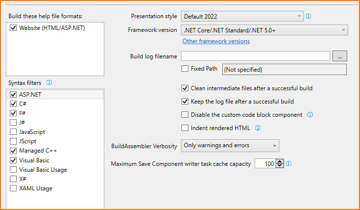
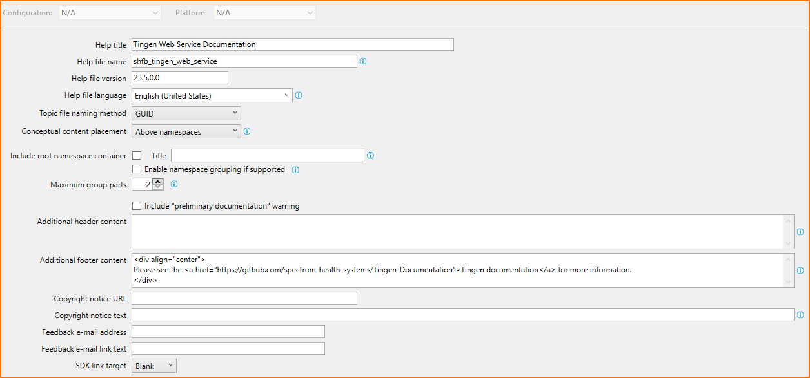
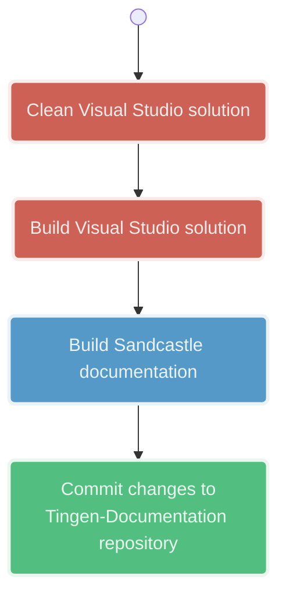

<!-- u250602 -->

# Sandcastle Help File Builder

* [Integration with Visual Studio 2022](#integration-with-visual-studio-2022)
* [Create a new Visual Studio 2022 Documentation Project](#create-a-new-visual-studio-2022-documentation-project)
* [Generating Sandcastle documentation](#generating-sandcastle-documentation)

# Integration with Visual Studio 2022

Install the latest version of the [Sandcastle Help File Builder](https://github.com/EWSoftware/SHFB).

It is recommended to also install the [Extended XML Doc Comments Provider (VS2022+)](https://marketplace.visualstudio.com/items?itemName=EWoodruff.ExtendedDocCommentsProvider2022) extension.

# Create a new Visual Studio 2022 Documentation Project

You will need to create a Documentation Project for each project you want to document.

Documentation projects should start with `sfhb-`.

For example, the Documentation Project for the `tingen-web-service` would be named `sfhb-tingen-web-service`.

To create the new project:

1. Start Visual Studio
2. Create a new `Sandcastle Help File Builder Project`
3. Name the project `shfb-%Project-Name%` (example: `shfb-tingen-web-service`)
4. The location should be `tingen-documentation/sandcastle/%Project-Name%`
5. Click "Create"
6. Close the project

## Add the documentation project to the solution

1. Open the *solution* that the documentation will be created for
2. Add a new Solution Folder named `SHFB`
3. Add the documentation project to the `SHFB` folder

## Generate XML documentation

In the project you are creating documentation for:

1. Right-click -> **Properties**
2. **Build** -> **Output**
3. Check **XML documentation file**
4. Change the file path to `AppData\XmlDoc\generated.xml

## Configure the documentation project

### Project Properties -> Build

1. Change **Framework version** to the correct framework



### Project Properties -> Help File

1. Change the **Help title**
2. Change the ** Help file version**
3. Add the following to **Additional footer content**  
```html
<div align="center">
Please see the <a href="https://github.com/spectrum-health-systems/Tingen-Documentation">Tingen documentation</a> for more information.
</div>
```



### Project Properties -> Help 1/Website

No changes.

### Project Properties -> MS Help Viewer

No changes.

### Project Properties -> Summaries

No changes.

### Project Properties -> Visibility

1. Check **Internal members**
2. Check **Private fields**
3. Check **Private members**


### Project Properties -> Missing Tags

No changes.

### Project Properties -> Paths

1. Change **Help content output path** to `..\..\docs\API\%Project-Name`


### Project Properties -> Components

No changes.

### Project Properties -> Plug-Ins

No changes.

### Project Properties -> Transform Args

No changes.

### Project Properties -> User Defined

No changes.

### Project Properties -> Build Events

No changes.

## Add the project to the Documentation Sources

Using the documentation project:

1. Right-click -> **Documentation Sources*
2. **Add documentation source**
3. Add the `.shfbproj` file

## Exclude documentation projects from the Solution build

On the VS2022 menu bar:

1. **Build** -> **Configuration Manager**
2. Uncheck **Build* for all documentation projects

Save everything

# Generating Sandcastle documentation

<div align="center">



</div>

## GitHub Pages

A few minutes after the `tingen-documention` repository has been updated, the GitHub Pages site will be refreshed.