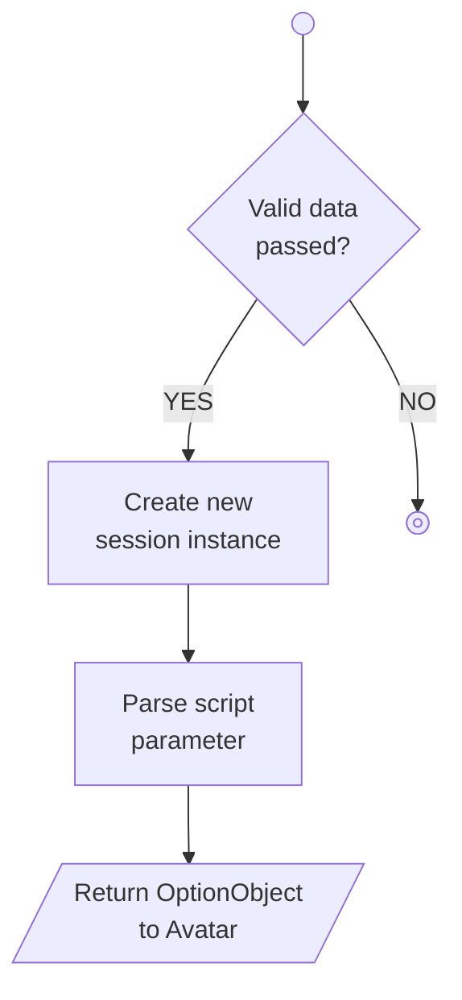

<!-- u250716 -->

# Core.()

```mermaid
flowchart TB
  %% Components      
  Start@{ shape: sm-circ }              
  ValidDataPassed@{ shape: diam, label: "Valid data\npassed?" }
  CreateNewSessionInstance@{ shape: rect, label: "Create new\nsession instance" }
  ParseScriptParameter@{ shape: rect, label: "Parse script\nparameter" }
  ReturnOptionObjectToAvatar@{ shape: lean-r, label: "Return OptionObject\nto Avatar" }
  Stop@{ shape: fr-circ }
  %%Layout
  Start --> ValidDataPassed
  ValidDataPassed --NO--> Stop
  ValidDataPassed --YES--> CreateNewSessionInstance --> ParseScriptParameter -->ReturnOptionObjectToAvatar
```
